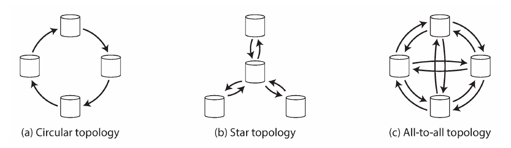

# Designing Data Intensive Applications
## Replication
Replication means keeping a copy of the same data on multiple machines that are connected via a network.
There are several reasons why you might want to replicate data: 

* Keep data geographically close to your users (reduce latency)
* Allow the system to continue working even if some of its parts have failed (increase availability)
* Scale out the number of machines that can serve read queries (increase read throughput)

*In this chapter we will assume that your dataset is so small that each machine can hold a copy of the
entire dataset.*

If the data that you're replicating does not change over time, you just need to copy the data to every node once, and
you're done. All of the difficulty in replication lies in handling changes to replicated data. We will
discuss three popular algorithms for replicating changes between nodes: *single-leader*, *multi-leader*, and
*leaderless* replication. Also, there are many trade-offs to consider with replication: for example, whether to use
synchronous or asynchronous replication, and how to handle failed replicas.

### Leaders and Followers
How do we ensure that all the data ends up on all the replicas?
Every write to the database needs to be processed by every replica; otherwise, the replicas would no longer contain
the same data. The most common solution for this is called leader-based replication (also known as active/passive or
master–slave replication) It works as follows:

1. One of the replicas is designated the leader (also known as master or primary). When clients want to write to the
  database, they must send their requests to the leader, which first writes the new data to its local storage.
2. The other replicas are known as followers (read replicas, slaves, secondaries, or hot standbys). Whenever the leader
  writes new data to its local storage, it also sends the data change to all of its followers as part of a replication
  log or change stream. Each follower takes the log from the leader and updates its local copy of the database
  accordingly, by applying all writes in the same order as they were processed on the leader.
3. When a client wants to read from the database, it can query either the leader or any of the followers. However,
  writes are only accepted on the leader (the followers are read-only from the client's point of view).

#### Synchronous Versus Asynchronous Replication
An important detail of a replicated system is whether the replication happens synchronously or asynchronously. The
advantage of synchronous replication is that the follower is guaranteed to have an up-to-date copy of the data that is
consistent with the leader. The disadvantage is that if the synchronous follower doesn't respond (because it has
crashed, or there is a network fault, or for any other reason), the write cannot be processed.  In practice, if you
enable synchronous replication on a database, it usually means that one of the followers is synchronous, and the others
are asynchronous. If the synchronous follower becomes unavailable or slow, one of the asynchronous followers is made
synchronous. This guarantees that you have an up-to-date copy of the data on at least two nodes: the leader and one
synchronous follower. This configuration is sometimes also called semi-synchronous.

Often, leader-based replication is configured to be completely asynchronous. In this case, if the leader fails and is
not recoverable, any writes that have not yet been replicated to followers are lost. This means that a write is not
guaranteed to be durable, even if it has been confirmed to the client. However, a fully asynchronous configuration has
the advantage that the leader can continue processing writes, even if all of its followers have fallen behind. Weakening
durability may sound like a bad trade-off, but asynchronous replication is nevertheless widely used, especially if there
are many followers or if they are geographically distributed.

#### Setting Up New Followers
How do you ensure that the new follower has an accurate copy of the leader's data?

Simply copying data files from one node to another is typically not sufficient: clients are constantly writing to the
database, and the data is always in flux, so a standard file copy would see different parts of the database at different
points in time. The result might not make any sense. You could make the files on disk consistent by locking the database
(making it unavailable for writes), but that would go against our goal of high availability. Fortunately, setting up a
follower can usually be done without downtime. Conceptually, the process looks like this:

1. Take a consistent snapshot of the leader's database at some point in time—if possible, without taking a lock on the
   entire database. Most databases have this feature, as it is also required for backups.
2. Copy the snapshot to the new follower node. 
3. The follower connects to the leader and requests all the data changes that have happened since the snapshot was
   taken.
4. When the follower has processed the backlog of data changes since the snapshot, we say it has caught up. It can now
   continue to process data changes from the leader as they happen.

#### Handling Node Outages
Our goal is to keep the system as a whole running despite individual node failures, and to keep the impact of a node
outage as small as possible. How do you achieve high availability with leader-based replication?

##### Follower failure: Catch-up recovery
On its local disk, each follower keeps a log of the data changes it has received from the leader. If a follower crashes
and is restarted, or if the network between the leader and the follower is temporarily interrupted, the follower can
recover quite easily: from its log, it knows the last transaction that was processed before the fault occurred. Thus,
the follower can connect to the leader and request all the data changes that occurred during the time when the follower
was disconnected. When it has applied these changes, it has caught up to the leader and can continue receiving a stream
of data changes as before.

##### Leader failure: Failover 
Handling a failure of the leader is trickier: one of the followers needs to be promoted to be the new leader, clients
need to be reconfigured to send their writes to the new leader, and the other followers need to start consuming data
changes from the new leader. This process is called failover.

Failover can happen manually or automatically. An automatic failover process usually consists of the following steps:
1. Determining that the leader has failed (in most cases, timeout is used).
2. Choosing a new leader. The best candidate for leadership is usually the replica with the most up-to-date data changes
   from the old leader (to minimize any data loss).
3. Reconfiguring the system to use the new leader. Clients now need to send their write requests to the new leader. If
   the old leader comes back, it might still believe that it is the leader, not realizing that the other replicas have
   forced it to step down. The system needs to ensure that the old leader becomes a follower and recognizes the new
   leader.

Failover is fraught with things that can go wrong:
* If asynchronous replication is used, the new leader may not have received all the writes from the old leader before it
  failed. If the former leader rejoins the cluster after a new leader has been chosen, what should happen to those
  writes?  The new leader may have received conflicting writes in the meantime. The most common solution is for the old
  leader's unreplicated writes to simply be discarded, which may violate clients' durability expectations.
* Discarding writes is especially dangerous if other storage systems outside of the database need to be coordinated with
  the database contents. For example, in one incident at GitHub, an out-of-date MySQL follower was promoted to leader.
  The database used an autoincrementing counter to assign primary keys to new rows, but because the new leader's counter
  lagged behind the old leader's, it reused some primary keys that were previously assigned by the old leader.  These
  primary keys were also used in a Redis store, so the reuse of primary keys resulted in inconsistency between MySQL
  and Redis, which caused some private data to be disclosed to the wrong users.
* In certain fault scenarios, it could happen that two nodes both believe that they are the leader. This situation is
  called split brain, and it is dangerous: if both leaders accept writes, and there is no process for resolving
  conflicts, data is likely to be lost or corrupted. As a safety catch, some systems have a mechanism to shut down one
  node if two leaders are detected.ii However, if this mechanism is not carefully designed, you can end up with both
  nodes being shut down.
* What is the right timeout before the leader is declared dead? A longer timeout means a longer time to recovery in the
  case where the leader fails. However, if the timeout is too short, there could be unnecessary failovers.

There are no easy solutions to these problems. For this reason, some operations teams prefer to perform failovers
manually, even if the software supports automatic failover.

#### Implementation of Replication Logs
How does leader-based replication work under the hood?

##### Statement-based replication
The leader logs every write request (every `INSERT`, `UPDATE` or `DELETE`) that it executes and sends that statement log to
its followers and each follower parses and executes that statement as if it had been received from a client.

Various ways in which this approach can break down:
* Non-deterministic functions such as `NOW()` or `RAND()` is likely to generate a different value on each replica. This
  can also be true for any statement with non-deterministic side effects.
* If statements depending on the data must be executed in exactly the same order on each replica, or else they may have
  a different effect. This can be limiting when there are multiple concurrently executing transactions.

Possible work around: the leader can replace any nondeterministic function calls with a fixed return value when the
statement is logged so that the followers all get the same value. However, because there are so many edge cases, other
replication methods are now generally preferred.

##### Write-ahead log (WAL) shipping
As discussed in Chapter 3, every write is appended to a log. For log structured engines, this log is the main place for
storage, and in the case of a B-tree, every modification is first written to a write-ahead log so that the index can be
restored to a consistent state after a crash.

We can use these logs to build a replica on another node. The leader just needs to send it across the network to its
followers and they build a copy of the exact same data structures as found on the leader. This method of replication is
used in PostgreSQL and Oracle.

Since these logs describes the data on a very a low level, the replication is coupled to the storage engine. If the
database changes its storage format from one version to another, it is typically not possible to run different versions
of the database software on the leader and the followers. However, if a replication protocol allows the follower to use
a newer software version than the leader, you can perform a zero-downtime upgrade of the database software by first
upgrading the followers and then performing a failover to make one of the upgraded nodes the new leader. If the
replication protocol does not allow this version mismatch, as is often the case with WAL shipping, such upgrades require
downtime.

#### Logical (row-based) log replication
We can use different log formats for replication and the storage engine to decouple them. This is called logical log.
Logical logs are a sequence of records describing writes to database at the granularity of a row: 

* Inserted row contains the value for all the columns.
* Deleted row contains enough value to identify the row.
* Updated row contains enough value to identify and update row.

A logical log can more easily be kept backward compatible, allowing the leader and the follower to run different
versions of the database software, or even different storage engines. It is also easier for external applications to
parse. This aspect is useful if you want to send the contents of a database to an external system, such as a data
warehouse for offline analysis, or for building custom indexes and caches. This technique is called *change data
capture*.

#### Trigger-based replication
Sometimes you want flexibility in the replication. For example, if you want to only replicate a subset of the data, or
want to replicate from one kind of database to another, or if you need conflict resolution logic, then you may need to
move replication up to the application layer.

Some tools, can make data changes available to an application by reading the database log. An alternative is to use
features that are available in many relational databases: triggers and stored procedures.

A trigger lets you register custom application code that is automatically executed when a data change (write
transaction) occurs in a database system. The trigger has the opportunity to log this change into a separate table, from
which it can be read by an external process. That external process can then apply any necessary application logic and
replicate the data change to another system.

Trigger-based replication typically has greater overheads than other replication methods, and is more prone to bugs and
limitations than the database’s built-in replication. However, it can nevertheless be useful due to its flexibility.

### Problems with Replication Lag
In *read-scaling* architecture, you can increase the capacity for serving read-only requests simply by adding more
followers. However, this approach only realistically works with asynchronous replication—if you tried to synchronously
replicate to all followers, a single node failure or network outage would make the entire system unavailable for
writing. And the more nodes you have, the likelier it is that one will be down, so a fully synchronous configuration
would be very unreliable.

If an application reads from an asynchronous follower, it may see outdated information if the follower has fallen
behind. This leads to apparent inconsistencies in the database: if you run the same query on the leader and a follower
at the same time, you may get different results, because not all writes have been reflected in the follower. This
inconsistency is just a temporary state—if you stop writing to the database and wait a while, the followers will
eventually catch up and become consistent with the leader. For that reason, this effect is known as eventual
consistency.

The term “eventually” is deliberately vague: in general, there is no limit to how far a replica can fall behind. In
normal operation, the delay between a write happening on the leader and being reflected on a follower—the replication
lag—may be only a fraction of a second, and not noticeable in practice. However, if the system is operating near
capacity or if there is a problem in the network, the lag can easily increase to several seconds or even minutes. When
the lag is so large, the inconsistencies it introduces are not just a theoretical issue but a real problem for
applications.

#### Reading Your Own Writes
When new data is submitted, it must be sent to the leader, but when the user views the data, it can be read from a
follower. This new data might not have been reached to the replica yet. Therefore, the user thinks what they submitted
is lost. In this situation, we need *read-after-write consistency*, also known as *read-your-writes consistency*. There
are various possible techniques to implement this consistency:

* When reading something that the user may have modified, read it from the leader; otherwise, read it from a follower.
  This requires that you have some way of knowing whether something might have been modified, without actually querying
  it (e.g: always read the user’s own profile in a social network from the leader, and any other users’ profiles from a
  follower.
* If most things in the application are potentially editable by the user, that approach won’t be effective, as most
  things would have to be read from the leader (negating the benefit of read scaling). In that case, other criteria may
  be used to decide whether to read from the leader. For example, you could track the time of the last update and, for
  one minute after the last update, make all reads from the leader. You could also monitor the replication lag on
  followers and prevent queries on any follower that is more than one minute behind the leader.
* The client can remember the timestamp of its most recent write—then the system can ensure that the replica serving
  any reads for that user reflects updates at least until that timestamp. If a replica is not sufficiently up to date,
  either the read can be handled by another replica or the query can wait until the replica has caught up.

Another complication arises when the same user is accessing your service from multiple devices, for example a desktop
web browser and a mobile app. In this case you may want to provide *cross-device read-after-write consistency*: if the
user enters some information on one device and then views it on another device, they should see the information they
just entered.

#### Monotonic Reads
Our second example of an anomaly that can occur when reading from asynchronous followers is that it’s possible for a
user to see things moving backward in time. This can happen if a user makes several reads from different replicas. For
example, making the same query twice, first to a follower with little lag, then to a follower with greater lag. (This
scenario is quite likely if the user refreshes a web page, and each request is routed to a random server.)

Monotonic reads is a guarantee that this kind of anomaly does not happen. It’s a lesser guarantee than strong
consistency, but a stronger guarantee than eventual consistency. When you read data, you may see an old value; monotonic
reads only means that if one user makes several reads in sequence, they will not see time go backward i.e., they will
not read older data after having previously read newer data.

One way of achieving monotonic reads is to make sure that each user always makes their reads from the same replica. For
example, the replica can be chosen based on a hash of the user ID, rather than randomly. However, if that replica fails,
the user’s queries will need to be rerouted to another replica.

#### Consistent Prefix Reads
Our third example of replication lag anomalies concerns violation of causality. Imagine the following short dialog
between Mr. Poons and Mrs. Cake:

* *Mr. Poons*: How far into the future can you see, Mrs. Cake?
* *Mrs. Cake*: About ten seconds usually, Mr. Poons.

There is a causal dependency between those two sentences: Mrs. Cake heard Mr. Poons’s question and answered it. Now,
imagine a third person is listening to this conversation through followers. The things said by Mrs. Cake go through a
follower with little lag, but the things said by Mr. Poons have a longer replication lag. This observer would hear the
following:

* *Mrs. Cake*: About ten seconds usually, Mr. Poons.
* *Mr. Poons*: How far into the future can you see, Mrs. Cake?

To the observer it looks as though Mrs. Cake is answering the question before Mr. Poons has even asked it.

Preventing this kind of anomaly requires another type of guarantee: consistent prefix reads. This guarantee says that if
a sequence of writes happens in a certain order, then anyone reading those writes will see them appear in the same order.

This is a particular problem in partitioned (sharded) databases. If the database always applies writes in the same
order, reads always see a consistent prefix, so this anomaly cannot happen. However, in many distributed databases,
different partitions operate independently, so there is no global ordering of writes: when a user reads from the
database, they may see some parts of the database in an older state and some in a newer state.

One solution is to make sure that any writes that are causally related to each other are written to the same
partition—but in some applications that cannot be done efficiently. There are also algorithms that explicitly keep track
of causal dependencies, a topic that we will return to later.

#### Solutions for Replication Lag
When working with an eventually consistent system, it is worth thinking about how the application behaves if the
replication lag increases to several minutes or even hours. If the answer is “no problem,” that’s great. However, if the
result is a bad experience for users, it’s important to design the system to provide a stronger guarantee, such as
read-after-write. Pretending that replication is synchronous when in fact it is asynchronous is a recipe for problems
down the line.

It would be better if application developers didn’t have to worry about subtle replication issues and could just trust
their databases to “do the right thing.” This is why transactions exist: they are a way for a database to provide
stronger guarantees so that the application can be simpler.

Single-node transactions have existed for a long time. However, in the move to distributed (replicated and
partitioned) databases, many systems have abandoned them, claiming that transactions are too expensive in terms of
performance and availability, and asserting that eventual consistency is inevitable in a scalable system. There is some
truth in that statement, but it is overly simplistic, and we will develop a more nuanced view over the course of the
rest of this book.

### Multi-Leader Replication
A natural extension of the leader-based replication model is to allow more than one node to accept writes. Replication
still happens in the same way: each node that processes a write must forward that data change to all the other nodes. We
call this a *multi-leader* configuration (also known as *master–master* or *active/active replication*). In this setup,
each leader simultaneously acts as a follower to the other leaders.

#### Use Cases for Multi-Leader Replication
It rarely makes sense to use a multi-leader setup within a single datacenter, because the benefits rarely outweigh the
added complexity. However, there are some situations in which this configuration is reasonable.

##### Multi-datacenter operation
In a multi-leader configuration, you can have a leader in each datacenter. However, with a normal leader-based
replication setup, the leader has to be in one of the datacenters, and all writes must go through that datacenter.

Let’s compare how the single-leader and multi-leader configurations fare in a multidatacenter deployment:

**Performance**: In a multi-leader configuration, every write can be processed in the local datacenter and is replicated
asynchronously to the other datacenters. Thus, the interdatacenter network delay is hidden from users, which means the
perceived performance may be better.

**Tolerance of datacenter outages**: In a multi-leader configuration, each datacenter can continue operating
independently of the others, and replication catches up when the failed datacenter comes back online.

**Tolerance of network problems**: Traffic between datacenters usually goes over the public internet, which may be less
reliable than the local network within a datacenter.A multi-leader configuration with asynchronous replication can
usually tolerate network problems better: a temporary network interruption does not prevent writes being processed.

There is a big downside in multi-leader replication: same data may be concurrently modified in two different
datacenters, and those write conflicts must be resolved which will be discussed later.

As multi-leader replication is a somewhat retrofitted feature in many databases, there are often subtle configuration
pitfalls and surprising interactions with other database features. For example, autoincrementing keys, triggers, and
integrity constraints can be problematic. For this reason, multi-leader replication is often considered dangerous
territory that should be avoided if possible.

##### Clients with offline operation
Another situation is application that needs to continue to work while disconnected from the internet (calendar). If you
make any changes while you are offline, they need to be synced with a server and your other devices when the device is
next online. In this case, every device has a local database that acts as a leader (it accepts write requests), and
there is an asynchronous multi-leader replication process (sync) between the replicas of your calendar on all of your
devices. From an architectural point of view, this setup is essentially the same as multi-leader replication between
datacenters, taken to the extreme: each device is a “datacenter,” and the network connection between them is extremely
unreliable.

##### Collaborative editing
We don’t usually think of collaborative editing as a database replication problem, but it has a lot in common with the
previously mentioned offline editing use case. When one user edits a document, the changes are instantly applied to
their local replica and asynchronously replicated to the server and any other users who are editing the same document.

If you want to guarantee that there will be no editing conflicts, the application must obtain a lock on the document
before a user can edit it. If another user wants to edit the same document, they first have to wait until the first user
has committed their changes and released the lock. This collaboration model is equivalent to single-leader replication
with transactions on the leader.

However, for faster collaboration, you may want to make the unit of change very small and avoid locking. This approach
allows multiple users to edit simultaneously, but it also brings all the challenges of multi-leader replication,
including requiring conflict resolution.

#### Handling Write Conflicts
The biggest problem with multi-leader replication is that write conflicts can occur, which means that conflict
resolution is required. This problem does not occur in a single-leader database.

##### Synchronous versus asynchronous conflict detection
In a single-leader database, the second writer will either block and wait for the first write to complete, or abort the
second write transaction, forcing the user to retry the write. On the other hand, in a multi-leader setup, both writes
are successful, and the conflict is only detected asynchronously at some later point in time. At that time, it may be
too late to ask the user to resolve the conflict.

In principle, you could make the conflict detection synchronous—i.e., wait for the write to be replicated to all
replicas before telling the user that the write was successful. However, by doing so, you would lose the main advantage
of multi-leader replication: allowing each replica to accept writes independently. If you want synchronous conflict
detection, you might as well just use single-leader replication.

##### Conflict avoidance
The simplest strategy for dealing with conflicts is to avoid them: if the application can ensure that all writes for a
particular record go through the same leader, then conflicts cannot occur. Since many implementations of multi-leader
replication handle conflicts quite poorly, avoiding conflicts is a frequently recommended approach.

##### Converging toward a consistent state
A single-leader database applies writes in a sequential order: if there are several updates to the same field, the last
write determines the final value of the field. In a multi-leader configuration, there is no defined ordering of writes,
so it’s not clear what the final value should be. If each replica simply applied writes in the order that it saw the
writes, the database would end up in an inconsistent state. Thus, the database must resolve the conflict in a
*convergent* way, which means that all replicas must arrive at the same final value when all changes have been
replicated.

There are various ways of achieving convergent conflict resolution:
* Give each write a unique ID (e.g., a timestamp, a long random number, a UUID, or a hash of the key and value), pick
  the write with the highest ID as the winner, and throw away the other writes. If a timestamp is used, this technique
  is known as *last write wins* (LWW). Although this approach is popular, it is dangerously prone to data loss.
* Give each replica a unique ID, and let writes that originated at a higher-numbered replica always take precedence over
  writes that originated at a lowernumbered replica. This approach also implies data loss.
* Somehow merge the values together.
* Record the conflict in an explicit data structure that preserves all information, and write application code that
  resolves the conflict at some later time (perhaps by prompting the user).

##### Custom conflict resolution logic
As the most appropriate way of resolving a conflict may depend on the application, most multi-leader replication tools
let you write conflict resolution logic using application code. That code may be executed on write or on read:

###### On write
As soon as the database system detects a conflict in the log of replicated changes, it calls the conflict handler. This
handler typically cannot prompt a user—it runs in a background process and it must execute quickly.

###### On read
When a conflict is detected, all the conflicting writes are stored. The next time the data is read, these multiple
versions of the data are returned to the application. The application may prompt the user or automatically resolve the
conflict, and write the result back to the database.

Note that conflict resolution usually applies at the level of an individual row or document, not for an entire
transaction. Thus, if you have a transaction that atomically makes several different writes, each write is still
considered separately for the purposes of conflict resolution.

#### Multi-Leader Replication Topologies
A replication topology describes the communication paths along which writes are propagated from one node to another.

The most general topology is all-to-all, in which every leader sends its writes to every other leader. However, more
restricted topologies are also used: for example, MySQL by default supports only a circular topology, in which each node
receives writes from one node and forwards those writes (plus any writes of its own) to one other node. Another popular
topology has the shape of a star: one designated root node forwards writes to all of the other nodes. The star topology
can be generalized to a tree.

In circular and star topologies, to prevent infinite replication loops, When a node receives a data change that is
tagged with its own identifier, that data change is ignored, because the node knows that it has already been processed.

A problem with circular and star topologies is that if just one node fails, it can interrupt the flow of replication
messages between other nodes, causing them to be unable to communicate until the node is fixed. The topology could be
reconfigured to work around the failed node, but in most deployments such reconfiguration would have to be done
manually. The fault tolerance of a more densely connected topology (such as all-to-all) is better because it allows
messages to travel along different paths, avoiding a single point of failure.

On the other hand, all-to-all topologies can have issues too. In particular, some network links may be faster than
others, with the result that some replication messages may “overtake” others. This is a problem of causality, similar to
the one we saw in “Consistent Prefix Reads”: Simply attaching a timestamp to every write is not sufficient, because
clocks cannot be trusted to be sufficiently in sync to correctly order these events at leader 2.

To order these events correctly, a technique called *version vectors* can be used, which we will discuss later in this
chapter. However, conflict detection techniques are poorly implemented in many multi-leader replication systems. If you
are using a system with multi-leader replication, it is worth being aware of these issues, carefully reading the
documentation, and thoroughly testing your database to ensure that it really does provide the guarantees you believe it
to have.

### Leaderless Replication
The replication approaches we have discussed so far are based on the idea that a client sends a write request to one
node (the leader), and the database system takes care of copying that write to the other replicas. A leader determines
the order in which writes should be processed, and followers apply the leader’s writes in the same order.

Some data storage systems take a different approach, abandoning the concept of a leader and allowing any replica to
directly accept writes from clients. Some of the earliest replicated data systems were leaderless, but the idea was
mostly forgotten during the era of dominance of relational databases. It once again became a fashionable architecture
for databases after Amazon used it for its in-house *Dynamo* system. Riak, Cassandra, and Voldemort are open source
datastores with leaderless replication models inspired by Dynamo, so this kind of database is also known as
*Dynamo-style*.

In some leaderless implementations, the client directly sends its writes to several replicas,
while in others, a coordinator node does this on behalf of the client. However,
**unlike a leader database, that coordinator does not enforce a particular ordering of
writes. As we shall see, this difference in design has profound consequences for the
way the database is used.**

#### Writing to the Database When a Node Is Down
Imagine you have a database with three replicas, and one of the replicas is currently unavailable—perhaps it is being
rebooted to install a system update. In a leader-based configuration, if you want to continue processing writes, you may
need to perform a failover. On the other hand, in a leaderless configuration, failover does not exist. Therefore, the
client sends the write to all three replicas in parallel, and the two available replicas accept the write but the
unavailable replica misses it. Let’s say that it’s sufficient for two out of three replicas to acknowledge the write:
after the user has received two ok responses, we consider the write to be successful. The client simply ignores the fact
that one of the replicas missed the write.

Now imagine that the unavailable node comes back online, and clients start reading from it. Any writes that happened
while the node was down are missing from that node. Thus, if you read from that node, you may get stale (outdated)
values as responses.

To solve that problem, when a client reads from the database, it doesn’t just send its request to one replica: read
requests are also sent to several nodes in parallel. The client may get different responses from different nodes; i.e.,
the up-to-date value from one node and a stale value from another. Version numbers are used to determine which value is
newer.

##### Read repair and anti-entropy
Two mechanisms are often used in Dynamo-style datastores ensure that eventually all the data is copied to every replica:

*Read repair*

When a client makes a read from several nodes in parallel, it can detect any stale responses. The client sees that a
replica has a stale value and writes the newer value back to that replica. This approach works well for values that are
frequently read.

*Anti-entropy process*

In addition, some datastores have a background process that constantly looks for differences in the data between
replicas and copies any missing data from one replica to another. Unlike the replication log in leader-based
replication, this anti-entropy process does not copy writes in any particular order, and there may be a significant
delay before data is copied.

Note that without an anti-entropy process, values that are rarely read may be missing from some replicas and thus have
reduced durability, because read repair is only performed when a value is read by the application.

##### Quorums for reading and writing
If there are *n* replicas, every write must be confirmed by *w* nodes to be considered successful, and we must query at
least *r* nodes for each read. As long as *w + r > n*, we expect to get an up-to-date value when reading, because at
least one of the *r* nodes we’re reading from must be up to date. Reads and writes that obey these *r* and *w* values
are called *quorum* reads and writes. You can think of *r* and *w* as the minimum number of votes required for the read
or write to be valid.

If fewer than the required w or r nodes are available, writes or reads return an error. A node could be unavailable for
many reasons: because the node is down, due to an error executing the operation, due to a network interruption between
the client and the node, or for any number of other reasons. We only care whether the node returned a successful
response and don’t need to distinguish between different kinds of fault.

#### Limitations of Quorum Consistency
You can set *w* and *r* to smaller numbers, so that *w + r ≤ n*. In this case, reads and writes will still be sent to
*n* nodes, but a smaller number of successful responses is required for the operation to succeed. With a smaller w and r
you are more likely to read stale values. On the upside, this configuration allows lower latency and higher
availability.

However, even with *w + r > n*, there are likely to be edge cases where stale values are returned. These depend on the
implementation, but possible scenarios include:

* If a sloppy quorum is used, the *w* writes may end up on different nodes than the *r* reads, so there is no longer a
  guaranteed overlap between the *r* nodes and the *w* nodes.
* If two writes occur concurrently, it is not clear which one happened first. In this case, the only safe solution is to
  merge the concurrent writes. If a winner is picked based on a timestamp, writes can be lost due to clock skew.
* If a write happens concurrently with a read, the write may be reflected on only some of the replicas. In this case,
  it’s undetermined whether the read returns the old or the new value.
* If a write succeeded on some replicas but failed on others, and overall succeeded on fewer than *w* replicas, it is
  not rolled back on the replicas where it succeeded. This means that if a write was reported as failed, subsequent
  reads may or may not return the value from that write.
* If a node carrying a new value fails, and its data is restored from a replica carrying an old value, the number of
  replicas storing the new value may fall below *w*, breaking the quorum condition.

Thus, although quorums appear to guarantee that a read returns the latest written value, in practice it is not so
simple. Dynamo-style databases are generally optimized for use cases that can tolerate eventual consistency. The
parameters w and r allow you to adjust the probability of stale values being read, but it’s wise to not take them as
absolute guarantees.

In particular, you usually do not get the guarantees discussed before (reading your writes, monotonic reads, or
consistent prefix reads), so the previously mentioned anomalies can occur in applications. Stronger guarantees generally
require transactions or consensus. We will return to these topics in Chapter 7 and Chapter 9.

##### Monitoring staleness
There has been some research on measuring replica staleness in databases with leaderless replication and predicting the
expected percentage of stale reads depending on the parameters *n*, *w*, and *r*. This is unfortunately not yet common
practice, but it would be good to include staleness measurements in the standard set of metrics for databases. Eventual
consistency is a deliberately vague guarantee, but for operability it’s important to be able to quantify “eventual.”

#### Sloppy Quorums and Hinted Handoff
In a large cluster (with significantly more than *n* nodes) it’s likely that the client can connect to some database
nodes during the network interruption, just not to the nodes that it needs to assemble a quorum for a particular value.
In that case, database designers face a trade-off:

* Is it better to return errors to all requests for which we cannot reach a quorum of *w* or *r* nodes?
* Or should we accept writes anyway, and write them to some nodes that are reachable but aren’t among the *n* nodes on
  which the value usually lives?

The latter is known as a *sloppy quorum*: writes and reads still require *w* and *r* successful responses, but those may
include nodes that are not among the designated *n* “home” nodes for a value. By analogy, if you lock yourself out of
your house, you may knock on the neighbor’s door and ask whether you may stay on their couch temporarily. Once the
network interruption is fixed, any writes that one node temporarily accepted on behalf of another node are sent to the
appropriate “home” nodes. This is called hinted handoff. (Once you find the keys to your house again, your neighbor
politely asks you to get off their couch and go home.)

Sloppy quorums are particularly useful for increasing write availability: as long as any *w* nodes are available, the
database can accept writes. However, this means that even when *w + r > n*, you cannot be sure to read the latest value
for a key, because the latest value may have been temporarily written to some nodes outside of *n*.

Thus, a sloppy quorum actually isn’t a quorum at all in the traditional sense. It’s only an assurance of durability,
namely that the data is stored on w nodes somewhere. There is no guarantee that a read of r nodes will see it until the
hinted handoff has completed.

Sloppy quorums are optional in all common Dynamo implementations. In Riak they are enabled by default, and in Cassandra
and Voldemort they are disabled by default.

#### Detecting Concurrent Writes
Dynamo-style databases allow several clients to concurrently write to the same key, which means that conflicts will
occur even if strict quorums are used. The situation is similar to multi-leader replication, although in Dynamo-style
databases conflicts can also arise during read repair or hinted handoff.

##### Last write wins (discarding concurrent writes)
One approach for achieving eventual convergence is to declare that each replica need only store the most “recent” value
and allow “older” values to be overwritten and discarded. As indicated by the quotes around “recent,” this idea is
actually quite misleading. Even though concurrent writes don’t have a natural ordering, we can force an arbitrary order
on them. For example, we can attach a timestamp to each write, pick the biggest timestamp as the most “recent,” and
discard any writes with an earlier timestamp.

LWW achieves the goal of eventual convergence, but at the cost of durability: if there are several concurrent writes to
the same key, even if they were all reported as successful to the client, only one of the writes will survive and the
others will be silently discarded. Moreover, LWW may even drop writes that are not concurrent.

There are some situations, such as caching, in which lost writes are perhaps acceptable. If losing data is not
acceptable, LWW is a poor choice for conflict resolution. The only safe way of using a database with LWW is to ensure
that a key is only written once and thereafter treated as immutable, thus avoiding any concurrent updates to the same
key.

##### The “happens-before” relationship and concurrency
An operation A *happens before* another operation B if B knows about A, or depends on A, or builds upon A in some way.
Whether one operation happens before another operation is the key to defining what concurrency means. In fact, we can
simply say that two operations are concurrent if neither happens before the other. If one operation happened before
another, the later operation should overwrite the earlier operation, but if the operations are concurrent, we have a
conflict that needs to be resolved.

##### Capturing the happens-before relationship
Let’s look at an algorithm that determines whether two operations are concurrent, or whether one happened before
another. Note that the server can determine whether two operations are concurrent by looking at the version numbers—it
does not need to interpret the value itself (so the value could be any data structure). The algorithm works as follows:

* The server maintains a version number for every key, increments the version number every time that key is written, and
  stores the new version number along with the value written.
* When a client reads a key, the server returns all values that have not been overwritten, as well as the latest version
  number. A client must read a key before writing.
* When a client writes a key, it must include the version number from the prior read, and it must merge together all
  values that it received in the prior read. (The response from a write request can be like a read, returning all
  current values, which allows us to chain several writes like in the shopping cart example.)
* When the server receives a write with a particular version number, it can overwrite all values with that version
  number or below (since it knows that they have been merged into the new value), but it must keep all values with a
  higher version number (because those values are concurrent with the incoming write).

When a write includes the version number from a prior read, that tells us which previous state the write is based on. If
you make a write without including a version number, it is concurrent with all other writes, so it will not overwrite
anything—it will just be returned as one of the values on subsequent reads.

##### Merging concurrently written values
This algorithm ensures that no data is silently dropped, but it unfortunately requires
that the clients do some extra work: if several operations happen concurrently, clients
have to clean up afterward by merging the concurrently written values. Riak calls
these concurrent values siblings.

Merging sibling values is essentially the same problem as conflict resolution in multi-leader replication, which we
discussed previously. A simple approach is to just pick one of the values based on a version number (losing data), or,
doing a union. 

However, if you want to allow people to also remove things from their carts, and not just add things, then taking the
union of siblings may not yield the right result: if you merge two sibling carts and an item has been removed in only
one of them, then the removed item will reappear in the union of the siblings. To prevent this problem, an item cannot
simply be deleted from the database when it is removed; instead, the system must leave a marker with an appropriate
version number to indicate that the item has been removed when merging siblings. Such a deletion marker is known as a
*tombstone*. 

##### Version vectors
The discussed algorithm used only one replica. In situations whith multiple replicas, we need to use a version number
per replica as well as per key. Each replica increments its own version number when processing a write, and also keeps
track of the version numbers it has seen from each of the other replicas. This information indicates which values to
overwrite and which values to keep as siblings. The collection of version numbers from all the replicas is called a
version vector
