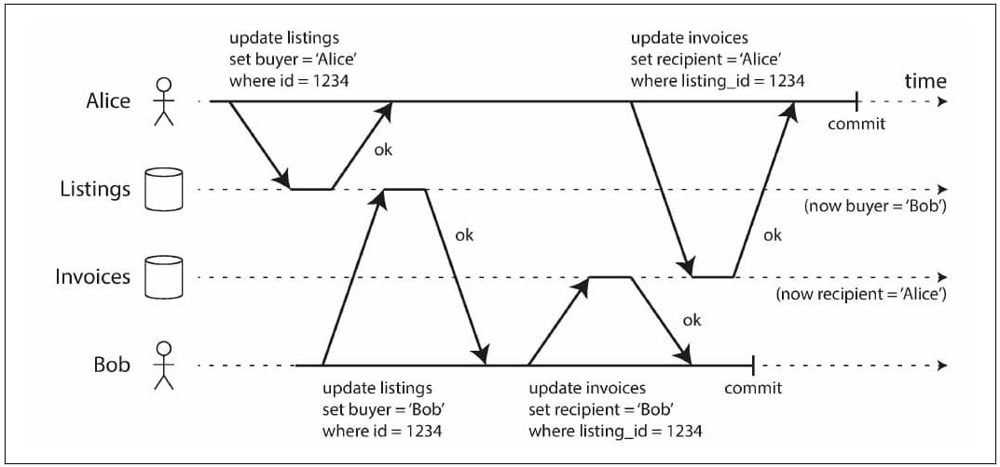

# Designing Data Intensive Applications
## Transactions
A transaction is a way for an application to group several reads and writes together into a logical unit. Conceptually,
all the reads and writes in a transaction are executed as one operation: either the entire transaction succeeds (commit)
or it fails (abort, rollback). By using transactions, the application is free to ignore certain potential error
scenarios and concurrency issues, because the database takes care of them instead (we call these safety guarantees).

Although transactions seem straightforward at first glance, there are actually many subtle but important details that
come into play. In this chapter, we will examine many examples of things that can go wrong, and explore the algorithms
that databases use to guard against those issues. We will go especially deep in the area of concurrency control,
discussing various kinds of race conditions that can occur and how databases implement isolation levels such as *read
committed*, *snapshot isolation*, and *serializability*.

### The Slippery Concept of a Transaction
With the hype around this new crop of distributed databases, there emerged a popular belief that transactions were the
antithesis of scalability, and that any large-scale system would have to abandon transactions in order to maintain good
performance and high availability. On the other hand, transactional guarantees are sometimes presented by database
vendors as an essential requirement for “serious applications” with “valuable data.” Both viewpoints are pure hyperbole.

#### The Meaning of ACID
The safety guarantees provided by transactions are often described by the well- known acronym ACID, which stands for
*Atomicity*, *Consistency*, *Isolation*, and *Durability*.

Today, when a system claims to be “ACID compliant,” it’s unclear what guarantees you can actually expect. ACID has
unfortunately become mostly a mar keting term. Systems that do not meet the ACID criteria are sometimes called BASE,
which stands for Basically Available, Soft state, and Eventual consistency. This is even more vague than the definition
of ACID. It seems that the only sensible definition of BASE is “not ACID”.

##### Atomicity
In general, atomic refers to something that cannot be broken down into smaller parts. If the writes are grouped together
into an atomic transaction, and the transaction cannot be completed (committed) due to a fault, then the transaction is
aborted and the database must discard or undo any writes it has made so far in that transaction.

Without atomicity, if an error occurs partway through making multiple changes, it’s difficult to know which changes have
taken effect and which haven’t. The application could try again, but that risks making the same change twice, leading to
duplicate or incorrect data. Atomicity simplifies this problem: if a transaction was aborted, the application can be
sure that it didn’t change anything, so it can safely be retried.

##### Consistency
The word consistency is terribly overloaded:
* In Chapter 5 we discussed replica consistency and the issue of eventual consistency that arises in asynchronously
  replicated systems.
* Consistent hashing is an approach to partitioning that some systems use for rebalancing.
* In the CAP theorem, the word consistency is used to mean linearizability.
* In the context of ACID, consistency refers to an application-specific notion of the database being in a “good state.”

It’s unfortunate that the same word is used with at least four different meanings.

The idea of ACID consistency is that you have certain statements about your data (invariants) that must always be
true—for example, in an accounting system, credits and debits across all accounts must always be balanced. If a
transaction starts with a database that is valid according to these invariants, and any writes during the transaction
preserve the validity, then you can be sure that the invariants are always satisfied.

However, this idea of consistency depends on the application’s notion of invariants, and it’s the application’s
responsibility to define its transactions correctly so that they preserve consistency. This is not something that the
database can guarantee: if you write bad data that violates your invariants, the database can’t stop you. (Some specific
kinds of invariants can be checked by the database, for example using foreign key constraints or uniqueness constraints.
However, in general, the application defines what data is valid or invalid—the database only stores it.)

Atomicity, isolation, and durability are properties of the database, whereas consistency (in the ACID sense) is a
property of the application. The application may rely on the database’s atomicity and isolation properties in order to
achieve consistency, but it’s not up to the database alone. Thus, the letter C doesn’t really belong in ACID.i

##### Isolation
Most databases are accessed by several clients at the same time. That is no problem if they are reading and writing
different parts of the database, but if they are accessing the same database records, you can run into concurrency
problems (race conditions).

Isolation in the sense of ACID means that concurrently executing transactions are isolated from each other: they cannot
step on each other’s toes. The classic database textbooks formalize isolation as *serializability*, which means that
each transaction can pretend that it is the only transaction running on the entire database. The database ensures that
when the transactions have committed, the result is the same as if they had run serially (one after another), even
though in reality they may have run concurrently.

##### Durability
The purpose of a database system is to provide a safe place where data can be stored without fear of losing it.
Durability is the promise that once a transaction has committed successfully, any data it has written will not be
forgotten, even if there is a hardware fault or the database crashes.

In a single-node database, durability typically means that the data has been written to nonvolatile storage such as a
hard drive or SSD. It usually also involves a write-ahead log or similar (see “Making B-trees reliable” on page 82),
which allows recovery in the event that the data structures on disk are corrupted. In a replicated database, durability
may mean that the data has been successfully copied to some number of nodes. In order to provide a durability guarantee,
a database must wait until these writes or replications are complete before reporting a transaction as successfully
committed.

#### Single-Object and Multi-Object Operations
Multi-object transactions require some way of determining which read and write operations belong to the same
transaction. In relational databases, that is typically done based on the client’s TCP connection to the database
server: on any particular connection, everything between a BEGIN TRANSACTION and a COMMIT statement is considered to be
part of the same transaction.

On the other hand, many nonrelational databases don’t have such a way of grouping operations together. Even if there is
a multi-object API (for example, a key-value store may have a multi-put operation that updates several keys in one
operation), that doesn’t necessarily mean it has transaction semantics: the command may succeed for some keys and fail
for others, leaving the database in a partially updated state.

##### Single-object writes
Atomicity and isolation also apply when a single object is being changed. For example, imagine you are writing a 20 KB
JSON document to a database:

* If the network connection is interrupted after the first 10 KB have been sent, does the database store that
  unparseable 10 KB fragment of JSON?
* If the power fails while the database is in the middle of overwriting the previous value on disk, do you end up with
  the old and new values spliced together?
* If another client reads that document while the write is in progress, will it see a partially updated value?

Those issues would be incredibly confusing, so storage engines almost universally aim to provide atomicity and isolation
on the level of a single object (such as a key- value pair) on one node. Atomicity can be implemented using a log for
crash recovery, and isolation can be implemented using a lock on each object (allowing only one thread to access an
object at any one time).

Some databases also provide more complex atomic operations, such as an increment operation, which removes the need for a
read-modify-write cycle. Similarly popular is a compare-and-set operation, which allows a write to happen only if the
value has not been concurrently changed by someone else.

These single-object operations are useful, as they can prevent lost updates when several clients try to write to the
same object concurrently. However, they are not transactions in the usual sense of the word. Compare-and-set and other
single-object operations have been dubbed “lightweight transactions” or even “ACID” for marketing purposes, but that
terminology is misleading. A transaction is usually understood as a mechanism for grouping multiple operations on
multiple objects into one unit of execution.

##### The need for multi-object transactions
Many distributed datastores have abandoned multi-object transactions because they are difficult to implement across
partitions, and they can get in the way in some scenarios where very high availability or performance is required.
However, there is nothing that fundamentally prevents transactions in a distributed database.

But do we need multi-object transactions at all? There are some use cases in which single-object inserts, updates, and
deletes are sufficient. However, in many other cases writes to several different objects need to be coordinated:

* In a relational data model, a row in one table often has a foreign key reference to a row in another table.
  (Similarly, in a graph-like data model, a vertex has edges to other vertices.) Multi-object transactions allow you to
  ensure that these references remain valid: when inserting several records that refer to one another, the foreign keys
  have to be correct and up to date, or the data becomes nonsensical.
* In a document data model, the fields that need to be updated together are often within the same document, which is
  treated as a single object—no multi-object transactions are needed when updating a single document. However, document
  databases lacking join functionality also encourage denormalization. When denormalized information needs to be
  updated, you need to update several documents in one go. Transactions are very useful in this situation to prevent
  denormalized data from going out of sync.
* In databases with secondary indexes, the indexes also need to be updated every time you change a value. These indexes
  are different database objects from a transaction point of view: for example, without transaction isolation, it’s
  possible for a record to appear in one index but not another, because the update to the second index hasn’t happened
  yet. Such applications can still be implemented without transactions. However, error handling becomes much more
  complicated without atomicity, and the lack of isolation can cause concurrency problems.

##### Handling errors and aborts
A key feature of a transaction is that it can be aborted and safely retried if an error
occurred. ACID databases are based on this philosophy: if the database is in danger
of violating its guarantee of atomicity, isolation, or durability, it would rather abandon
the transaction entirely than allow it to remain half-finished.

Errors will inevitably happen, but many software developers prefer to think only about the happy path rather than the
intricacies of error handling. For example, popular object-relational mapping (ORM) frameworks such as Rails’s
ActiveRecord and Django don’t retry aborted transactions—the error usually results in an exception bubbling up the
stack, so any user input is thrown away and the user gets an error message. This is a shame, because the whole point of
aborts is to enable safe retries.

Although retrying an aborted transaction is a simple and effective error handling mechanism, it isn’t perfect:

* If the transaction actually succeeded, but the network failed while the server tried to acknowledge the successful
  commit to the client (so the client thinks it failed), then retrying the transaction causes it to be performed
  twice—unless you have an additional application-level deduplication mechanism in place.
* If the error is due to overload, retrying the transaction will make the problem worse, not better. To avoid such
  feedback cycles, you can limit the number of retries, use exponential backoff, and handle overload-related errors
  differently from other errors (if possible).
* It is only worth retrying after transient errors (for example due to deadlock, isolation violation, temporary network
  interruptions, and failover); after a permanent error (e.g., constraint violation) a retry would be pointless.
* If the transaction also has side effects outside of the database, those side effects may happen even if the
  transaction is aborted. For example, if you’re sending an email, you wouldn’t want to send the email again every time
  you retry the transaction. If you want to make sure that several different systems either commit or abort together,
  two-phase commit can help.
* If the client process fails while retrying, any data it was trying to write to the database is lost.

### Weak Isolation Levels
Concurrency bugs are hard to find by testing and are also hard to reason about. For that reason, databases have long
tried to hide concurrency issues from application developers by providing transaction isolation. In theory, isolation
should make your life easier by letting you pretend that no concurrency is happening: serializable isolation means that
the database guarantees that transactions have the same effect as if they ran serially (i.e., one at a time, without any
concurrency).

In practice, isolation is unfortunately not that simple. Serializable isolation has a performance cost, and many
databases don’t want to pay that price. It’s therefore common for systems to use weaker levels of isolation, which
protect against some concurrency issues, but not all. Those levels of isolation are much harder to understand, and they
can lead to subtle bugs, but they are nevertheless used in practices.

Concurrency bugs can be caused when using weak transaction isolation. Therefore, rather than blindly relying on tools,
we need to develop a good understanding of the kinds of concurrency problems that exist, and how to prevent them. Then
we can build applications that are reliable and correct, using the tools at our disposal. In this section we will look
at several weak (nonserializable) isolation levels that are used in practice, and discuss in detail what kinds of race
conditions can and cannot occur, so that you can decide what level is appropriate to your application.

#### Read Committed
The most basic level of transaction isolation is read committed.v It makes two guarantees:

1. When reading from the database, you will only see data that has been committed (no dirty reads).
2. When writing to the database, you will only overwrite data that has been committed (no dirty writes).

##### No dirty reads
Imagine a transaction has written some data to the database, but the transaction has not yet committed or aborted. Can
another transaction see that uncommitted data? If yes, that is called a dirty read.

There are a few reasons why it’s useful to prevent dirty reads:
* If a transaction needs to update several objects, a dirty read means that another transaction may see some of the
  updates but not others.
* If a transaction aborts, any writes it has made need to be rolled back. If the database allows dirty reads, that means
  a transaction may see data that is later rolled back—i.e., which is never actually committed to the database.

##### No dirty writes
What happens if two transactions concurrently try to update the same object in a database? We don’t know in which order
the writes will happen, but we normally assume that the later write overwrites the earlier write.

However, what happens if the earlier write is part of a transaction that has not yet committed, so the later write
overwrites an uncommitted value? This is called a dirty write. **Transactions running at the read committed isolation
level must prevent dirty writes, usually by delaying the second write until the first write’s transaction has committed
or aborted**.

* If transactions update multiple objects, dirty writes can lead to a bad outcome. For example, consider Figure 7-5,
  which illustrates a used car sales website on which two people, Alice and Bob, are simultaneously trying to buy the
  same car. Buying a car requires two database writes: the listing on the website needs to be updated to reflect the
  buyer, and the sales invoice needs to be sent to the buyer. In the case of Figure 7-5, the sale is awarded to Bob
  (because he performs the winning update to the listings table), but the invoice is sent to Alice (because she performs
  the winning update to the invoices table). Read committed prevents such mishaps (in this example, with read committed
  isolation, the winner is Bob).



*  However, read committed does not prevent the race condition between two counter increments.

##### Implementing read committed

Most commonly, databases prevent dirty writes by using row-level locks: when a transaction wants to modify a particular
object (row or document), it must first acquire a lock on that object. It must then hold that lock until the transaction
is committed or aborted. Only one transaction can hold the lock for any given object; if another transaction wants to
write to the same object, it must wait until the first transaction is committed or aborted before it can acquire the
lock and continue. This locking is done automatically by databases in read committed mode (or stronger isolation
levels).

How do we prevent dirty reads? One option would be to use the same lock, and to require any transaction that wants to
read an object to briefly acquire the lock and then release it again immediately after reading. This would ensure that a
read couldn’t happen while an object has a dirty, uncommitted value. However, the approach of requiring read locks does
not work well in practice.

For that reason, most databases prevent dirty reads like this: for every object that is written, the database remembers
both the old committed value and the new value set by the transaction that currently holds the write lock. While the
transaction is ongoing, any other transactions that read the object are simply given the old value. Only when the new
value is committed do transactions switch over to reading the new value.

#### Snapshot Isolation and Repeatable Read
If you look superficially at read committed isolation, you could be forgiven for thinking that it does everything that a
transaction needs to do: it allows aborts (required for atomicity), it prevents reading the incomplete results of
transactions, and it prevents concurrent writes from getting intermingled. Indeed, those are useful features, and much
stronger guarantees than you can get from a system that has no transactions.

However, there are still plenty of ways in which you can have concurrency bugs when using this isolation level. An
anomaly can happen in read committed. This anomaly is called a *nonrepeatable* read or *read skew*. Read skew is
considered acceptable under read committed isolation.

In some situations we cannot tolerate such temporary inconsistency:

*Backups* 

Taking a backup requires making a copy of the entire database, which may take hours on a large database. During the time
that the backup process is running, writes will continue to be made to the database. Thus, you could end up with some
parts of the backup containing an older version of the data, and other parts containing a newer version. If you need to
restore from such a backup, the inconsistencies become permanent.

*Analytic queries and integrity checks*

Sometimes, you may want to run a query that scans over large parts of the database. Such queries are common in
analytics, or may be part of a periodic integrity check that everything is in order (monitoring for data corruption).
These queries are likely to return nonsensical results if they observe parts of the database at different points in
time.

*Snapshot isolation* is the most common solution to this problem. The idea is that each transaction reads from a
consistent snapshot of the database—that is, the transaction sees all the data that was committed in the database at
the start of the transaction. Even if the data is subsequently changed by another transaction, each transaction sees
only the old data from that particular point in time.

Snapshot isolation is a boon for long-running, read-only queries such as backups and analytics. It is very hard to
reason about the meaning of a query if the data on which it operates is changing at the same time as the query is
executing. When a transaction can see a consistent snapshot of the database, frozen at a particular point in time, it is
much easier to understand.

##### Implementing snapshot isolation
To implement snapshot isolation, databases use a generalization of the mechanism we saw for preventing dirty reads. The
database must potentially keep several different committed versions of an object, because various in-progress
transactions may need to see the state of the database at different points in time. Because it maintains several
versions of an object side by side, this technique is known as *multi- version concurrency control* (MVCC).

If a database only needed to provide read committed isolation, but not snapshot isolation, it would be sufficient to
keep two versions of an object: the committed version and the overwritten-but-not-yet-committed version. However,
storage engines that support snapshot isolation typically use MVCC for their read committed isolation level as well. A
typical approach is that read committed uses a separate snapshot for each query, while snapshot isolation uses the same
snapshot for an entire transaction.

In PostgreSQL (other implementations are similar) When a transaction is started, it is given a unique, always-increasing
transaction ID. Whenever a transaction writes anything to the database, the data it writes is tagged with the
transaction ID of the writer.

Each row in a table has a `created_by` field, containing the ID of the transaction that inserted this row into the
table. Moreover, each row has a `deleted_by` field, which is initially empty. If a transaction deletes a row, the row
isn’t actually deleted from the database, but it is marked for deletion by setting the `deleted_by` field to the ID of
the transaction that requested the deletion. At some later time, when it is certain that no transaction can any longer
access the deleted data, a garbage collection process in the database removes any rows marked for deletion and frees
their space. An update is internally translated into a delete and a create. 

##### Visibility rules for observing a consistent snapshot
When a transaction reads from the database, transaction IDs are used to decide which objects it can see and which are
invisible. By carefully defining visibility rules, the database can present a consistent snapshot of the database to the
application. This works as follows:

* At the time when the reader’s transaction started, the transaction that created the object had already committed.
* The object is not marked for deletion, or if it is, the transaction that requested deletion had not yet committed at
  the time when the reader’s transaction started.

A long-running transaction may continue using a snapshot for a long time, continuing to read values that (from other
transactions’ point of view) have long been overwritten or deleted. By never updating values in place but instead
creating a new version every time a value is changed, the database can provide a consistent snapshot while incurring
only a small overhead.

##### Indexes and snapshot isolation
How do indexes work in a multi-version database? One option is to have the index simply point to all versions of an
object and require an index query to filter out any object versions that are not visible to the current transaction.
When garbage collection removes old object versions that are no longer visible to any transaction, the corresponding
index entries can also be removed.

#### Preventing Lost Updates
The read committed and snapshot isolation levels we’ve discussed so far have been primarily about the guarantees of what
a read-only transaction can see in the presence of concurrent writes. We have mostly ignored the issue of two
transactions writing concurrently—we have only discussed dirty writes, one particular type of write-write conflict
that can occur.

There are several other interesting kinds of conflicts that can occur between concurrently writing transactions. The
best known of these is the lost update problem. The lost update problem can occur if an application reads some value
from the database, modifies it, and writes back the modified value (a read-modify-write cycle). If two transactions do
this concurrently, one of the modifications can be lost, because the second write does not include the first
modification. (We sometimes say that the later write clobbers the earlier write.) This pattern occurs in various
different scenarios:

* Incrementing a counter or updating an account balance (requires reading the current value, calculating the new value,
  and writing back the updated value)
* Making a local change to a complex value, e.g., adding an element to a list within a JSON document (requires parsing
  the document, making the change, and writing back the modified document)
* Two users editing a wiki page at the same time, where each user saves their changes by sending the entire page
  contents to the server, overwriting whatever is currently in the database

Because this is such a common problem, a variety of solutions have been developed.

##### Atomic write operations
Many databases provide atomic update operations, which remove the need to implement read-modify-write cycles in
application code. They are usually the best solution if your code can be expressed in terms of those operations. For
example, the following instruction is concurrency-safe in most relational databases:

`UPDATE counters SET value = value + 1 WHERE key = 'foo';`

Atomic operations are usually implemented by taking an exclusive lock on the object when it is read so that no other
transaction can read it until the update has been applied. This technique is sometimes known as cursor stability.
Another option is to simply force all atomic operations to be executed on a single thread.

Unfortunately, object-relational mapping frameworks make it easy to accidentally write code that performs unsafe
read-modify-write cycles instead of using atomic operations provided by the database. That’s not a problem if you know
what you are doing, but it is potentially a source of subtle bugs that are difficult to find by testing.

##### Explicit locking
Another option for preventing lost updates, if the database’s built-in atomic operations don’t provide the necessary
functionality, is for the application to explicitly lock objects that are going to be updated. Then the application can
perform a read-modify-write cycle, and if any other transaction tries to concurrently read the same object, it is
forced to wait until the first read-modify-write cycle has completed.

For example, consider a multiplayer game in which several players can move the same figure concurrently. In this case,
an atomic operation may not be sufficient, because the application also needs to ensure that a player’s move abides by
the rules of the game, which involves some logic that you cannot sensibly implement as a database query. Instead, you
may use a lock to prevent two players from concurrently moving the same piece

```
BEGIN TRANSACTION;
SELECT * FROM figures
WHERE name = 'robot' AND game_id = 222
FOR UPDATE;
-- Check whether move is valid, then update the position
-- of the piece that was returned by the previous SELECT.
UPDATE figures SET position = 'c4' WHERE id = 1234;
COMMIT;
```

The `FOR UPDATE` clause indicates that the database should take a lock on all rows returned by this query. This works,
but to get it right, you need to carefully think about your application logic. It’s easy to forget to add a necessary
lock somewhere in the code, and thus introduce a race condition.

##### Automatically detecting lost updates
Atomic operations and locks are ways of preventing lost updates by forcing the read-modify-write cycles to happen
sequentially. An alternative is to allow them to execute in parallel and, if the transaction manager detects a lost
update, abort the transaction and force it to retry its read-modify-write cycle.

An advantage of this approach is that databases can perform this check efficiently in conjunction with snapshot
isolation. Lost update detection is a great feature, because it doesn’t require application code to use any special
database features—you may forget to use a lock or an atomic operation and thus introduce a bug, but lost update
detection happens automatically and is thus less error-prone.

##### Compare-and-set
In databases that don’t provide transactions, you sometimes find an atomic compare-and-set operation. The purpose of
this operation is to avoid lost updates by allowing an update to happen only if the value has not changed since you last
read it. If the current value does not match what you previously read, the update has no effect, and the
read-modify-write cycle must be retried.

##### Conflict resolution and replication
In replicated databases, preventing lost updates takes on another dimension: since they have copies of the data on
multiple nodes, and the data can potentially be modified concurrently on different nodes, some additional steps need to
be taken to prevent lost updates.

Locks and compare-and-set operations assume that there is a single up-to-date copy of the data. However, databases with
multi-leader or leaderless replication usually allow several writes to happen concurrently and replicate them
asynchronously, so they cannot guarantee that there is a single up-to-date copy of the data. Thus, techniques based on
locks or compare-and-set do not apply in this context. 

Instead, a common approach in such replicated databases is to allow concurrent writes to create several conflicting
versions of a value (also known as siblings), and to use application code or special data structures to resolve and
merge these versions after the fact. Atomic operations can work well in a replicated context, especially if they are
commutative (i.e., you can apply them in a different order on different replicas, and still get the same result). 

The last write wins (LWW) conflict resolution method is prone to lost updates, as discussed before. Unfortunately, LWW
is the default in many replicated databases.

#### Write Skew and Phantoms
Write skew is an anomaly which is different from dirty writes and lost updates. You can think of write skew as a
generalization of the lost update problem. Write skew can occur if two transactions read the same objects, and then
update some of those objects (different transactions may update different objects). In the special case where different
transactions update the same object, you get a dirty write or lost update anomaly (depending on the timing).

We saw that there are various different ways of preventing lost updates. With write skew, our options are more
restricted:

* Atomic single-object operations don’t help, as multiple objects are involved.
* The automatic detection of lost updates that you find in some implementations of snapshot isolation unfortunately
  doesn’t help either. Automatically preventing write skew requires true serializable isolation.
* Some databases allow you to configure constraints, which are then enforced by the database. However, in some
  scenarios, you would need a constraint that involves multiple objects. Most databases do not have built-in support for
  such constraints, but you may be able to implement them with triggers or materialized views, depending on the
  database.
* If you can’t use a serializable isolation level, the second-best option in this case is probably to explicitly lock
  the rows that the transaction depends on (e.g. select for update).

In situations where this anomaly happens, a similar pattern can be found:

1. A `SELECT` query checks whether some requirement is satisfied by searching for rows that match some search condition.
2. Depending on the result of the first query, the application code decides how to continue (perhaps to go ahead with
   the operation, or perhaps to report an error to the user and abort).
3. If the application decides to go ahead, it makes a write (INSERT, UPDATE, or DELETE) to the database and commits the
   transaction.

The effect of this write changes the precondition of the decision of step 2. In other words, if you were to repeat the
SELECT query from step 1 after commiting the write, you would get a different result, because the write changed the set
of rows matching the search condition.

This effect, where a write in one transaction changes the result of a search query in another transaction, is called a
*phantom*. Snapshot isolation avoids phantoms in read-only queries, but in read-write transactions, phantoms can lead to
particularly tricky cases of write skew.

### Serializability
Serializable isolation is usually regarded as the strongest isolation level. It guarantees that even though transactions
may execute in parallel, the end result is the same as if they had executed one at a time, serially, without any
concurrency. Thus, the database guarantees that if the transactions behave correctly when run individually, they
continue to be correct when run concurrently—in other words, the database prevents all possible race conditions. 

But if serializable isolation is so much better than the mess of weak isolation levels, then why isn’t everyone using
it? To answer this question, we need to look at the options for implementing serializability, and how they perform. Most
databases that provide serializability today use one of three techniques, which we will explore in the rest of this
chapter:

* Literally executing transactions in a serial order 
* Two-phase locking, which for several decades was the only viable option
* Optimistic concurrency control techniques such as serializable snapshot isolation

For now, we will discuss these techniques primarily in the context of single-node databases; in Chapter 9 we will
examine how they can be generalized to transactions that involve multiple nodes in a distributed system.

#### Two-Phase Locking (2PL)
Two-phase locking is similar to using locks for dirty writes, but makes the lock requirements much stronger. Several
transactions are allowed to concurrently read the same object as long as nobody is writing to it. But as soon as anyone
wants to write (modify or delete) an object, exclusive access is required:

* If transaction A has read an object and transaction B wants to write to that object, B must wait until A commits or
  aborts before it can continue. (This ensures that B can’t change the object unexpectedly behind A’s back.)
* If transaction A has written an object and transaction B wants to read that object, B must wait until A commits or
  aborts before it can continue. 

In 2PL, writers don’t just block other writers; they also block readers and vice versa. Snapshot isolation has the
mantra *readers never block writers, and writers never block readers*, which captures this key difference between
snapshot isolation and two-phase locking. On the other hand, because 2PL provides serializability, it protects against
all the race conditions discussed earlier, including lost updates and write skew.

##### Implementation of two-phase locking
The blocking of readers and writers is implemented by a having a lock on each object in the database. The lock can
either be in shared mode or in exclusive mode. The lock is used as follows:

* If a transaction wants to read an object, it must first acquire the lock in shared mode. Several transactions are
  allowed to hold the lock in shared mode simultaneously, but if another transaction already has an exclusive lock on
  the object, these transactions must wait.
* If a transaction wants to write to an object, it must first acquire the lock in exclusive mode. No other transaction
  may hold the lock at the same time (either in shared or in exclusive mode), so if there is any existing lock on the
  object, the transaction must wait.
* If a transaction first reads and then writes an object, it may upgrade its shared lock to an exclusive lock. The
  upgrade works the same as getting an exclusive lock directly.
* After a transaction has acquired the lock, it must continue to hold the lock until the end of the transaction (commit
  or abort). This is where the name “two- phase” comes from: the first phase (while the transaction is executing) is
  when the locks are acquired, and the second phase (at the end of the transaction) is when all the locks are released.

Since so many locks are in use, it can happen quite easily that transaction A is stuck waiting for transaction B to
release its lock, and vice versa. This situation is called *deadlock*. The database automatically detects deadlocks
between transactions and aborts one of them so that the others can make progress. The aborted transaction needs to be
retried by the application.

##### Performance of two-phase locking
The big downside of two-phase locking, and the reason why it hasn’t been used by everybody since the 1970s, is
performance: transaction throughput and response times of queries are significantly worse under two-phase locking than
under weak isolation.

This is partly due to the overhead of acquiring and releasing all those locks, but more importantly due to reduced
concurrency. By design, if two concurrent transactions try to do anything that may in any way result in a race
condition, one has to wait for the other to complete.

Traditional relational databases don’t limit the duration of a transaction, because they are designed for interactive
applications that wait for human input. Consequently, when one transaction has to wait on another, there is no limit
on how long it may have to wait. Even if you make sure that you keep all your transactions short, a queue may form if
several transactions want to access the same object, so a transaction may have to wait for several others to complete
before it can do anything.

For this reason, databases running 2PL can have quite unstable latencies, and they can be very slow at high percentiles
if there is contention in the workload. It may take just one slow transaction, or one transaction that accesses a lot of
data and acquires many locks, to cause the rest of the system to grind to a halt. This instability is problematic when
robust operation is required.

Although deadlocks can happen with the lock-based read committed isolation level, they occur much more frequently under
2PL serializable isolation (depending on the access patterns of your transaction). This can be an additional performance
problem: when a transaction is aborted due to deadlock and is retried, it needs to do its work all over again. If
deadlocks are frequent, this can mean significant wasted effort.

##### Predicate locks
In order to solve the problem of phantoms, we need a predicate lock. It works similarly to the shared/exclusive lock
described earlier, but rather than belonging to a particular object (e.g., one row in a table), it belongs to all
objects that match some search condition.

A predicate lock restricts access as follows:

* If transaction A wants to read objects matching some condition, like in that SELECT query, it must acquire a
  shared-mode predicate lock on the conditions of the query. If another transaction B currently has an exclusive lock on
  any object matching those conditions, A must wait until B releases its lock before it is allowed to make its query.
* If transaction A wants to insert, update, or delete any object, it must first check whether either the old or the new
  value matches any existing predicate lock. If there is a matching predicate lock held by transaction B, then A must
  wait until B has committed or aborted before it can continue.

The key idea here is that a predicate lock applies even to objects that do not yet exist in the database, but which
might be added in the future (phantoms). If two-phase locking includes predicate locks, the database prevents all forms
of write skew and other race conditions, and so its isolation becomes serializable.

##### Index-range locks
Unfortunately, predicate locks do not perform well: if there are many locks by active transactions, checking for
matching locks becomes time-consuming. For that reason, most databases with 2PL actually implement index-range locking
(also known as next-key locking), which is a simplified approximation of predicate locking.

an approximation of the search condition is attached to one of the indexes. Now, if another transaction wants to insert,
update, or delete a booking for the same room and/or an overlapping time period, it will have to update the same part of
the index. In the process of doing so, it will encounter the shared lock, and it will be forced to wait until the lock
is released.

This provides effective protection against phantoms and write skew. Index-range locks are not as precise as predicate
locks would be (they may lock a bigger range of objects than is strictly necessary to maintain serializability), but
since they have much lower overheads, they are a good compromise.

If there is no suitable index where a range lock can be attached, the database can fall back to a shared lock on the
entire table. This will not be good for performance, since it will stop all other transactions writing to the table, but
it’s a safe fallback position.

#### Serializable Snapshot Isolation (SSI)
An algorithm called serializable snapshot isolation (SSI) is very promising. It provides full serializability, but has
only a small performance penalty compared to snapshot isolation. SSI is fairly new: it was first described in 2008 and
is the subject of Michael Cahill’s PhD thesis.

Today SSI is used both in single-node databases  and distributed databases. As SSI is so young compared to other
concurrency control mechanisms, it is still proving its performance in practice, but it has the possibility of being
fast enough to become the new default in the future.

##### Pessimistic versus optimistic concurrency control
Serial execution is, in a sense, pessimistic to the extreme: it is essentially equivalent to each transaction having an
exclusive lock on the entire database (or one partition of the database) for the duration of the transaction. We
compensate for the pessimism by making each transaction very fast to execute, so it only needs to hold the “lock” for a
short time.

By contrast, serializable snapshot isolation is an optimistic concurrency control technique. Optimistic in this context
means that instead of blocking if something potentially dangerous happens, transactions continue anyway, in the hope
that everything will turn out all right. When a transaction wants to commit, the database checks whether anything bad
happened (i.e., whether isolation was violated); if so, the transaction is aborted and has to be retried. Only
transactions that executed serializably are allowed to commit.

Optimistic concurrency control is an old idea, and its advantages and disadvantages have been debated for a long time.
It performs badly if there is high contention (many transactions trying to access the same objects), as this leads to a
high proportion of transactions needing to abort. If the system is already close to its maximum throughput, the
additional transaction load from retried transactions can make performance worse.

However, if there is enough spare capacity, and if contention between transactions is not too high, optimistic
concurrency control techniques tend to perform better than pessimistic ones. Contention can be reduced with commutative
atomic operations: for example, if several transactions concurrently want to increment a counter, it doesn’t matter in
which order the increments are applied (as long as the counter isn’t read in the same transaction), so the concurrent
increments can all be applied without conflicting.

As the name suggests, SSI is based on snapshot isolation—that is, all reads within a transaction are made from a
consistent snapshot of the database. This is the main difference compared to earlier optimistic concurrency control
techniques. On top of snapshot isolation, SSI adds an algorithm for detecting serialization conflicts among writes and
determining which transactions to abort.

##### Decisions based on an outdated premise
Under snapshot isolation, the result from the original query may no longer be up-to-date by the time the transaction
commits, because the data may have been modified in the meantime. Put another way, the transaction is taking an action
based on a premise (a fact that was true at the beginning of the transaction). Later, when the transaction wants to
commit, the original data may have changed—the premise may no longer be true.

When the application makes a query, the database doesn’t know how the application logic uses the result of that query.
To be safe, the database needs to assume that any change in the query result (the premise) means that writes in that
transaction may be invalid. In other words, there may be a causal dependency between the queries and the writes in the
transaction. In order to provide serializable isolation, the database must detect situations in which a transaction may
have acted on an outdated premise and abort the transaction in that case.

How does the database know if a query result might have changed? There are two cases to consider:
* Detecting reads of a stale MVCC object version (uncommitted write occurred before the read)
* Detecting writes that affect prior reads (the write occurs after the read)

##### Detecting stale MVCC reads
When a transaction reads from a consistent snapshot in an MVCC database, it ignores writes that were made by any other
transactions that hadn’t yet committed at the time when the snapshot was taken.

In order to prevent this anomaly, the database needs to track when a transaction ignores another transaction’s writes
due to MVCC visibility rules. When the transaction wants to commit, the database checks whether any of the ignored
writes have now been committed. If so, the transaction must be aborted.

Why wait until committing? Why not abort transaction immediately when the stale read is detected? Well, the database
doesn’t yet know whether that transaction is going to later perform a write. By avoiding unnecessary aborts, SSI
preserves snapshot isolation’s support for long-running reads from a consistent snapshot.

##### Detecting writes that affect prior reads
The second case to consider is when another transaction modifies data after it has been read. In order to deal with
this, similar to index-range locks, when a transaction writes to the database, it must look in the indexes for any other
transactions that have recently read the affected data. This process is similar to acquiring a write lock on the
affected key range, but rather than blocking until the readers have committed, the lock acts as a tripwire: it simply
notifies the transactions that the data they read may no longer be up to date so that they can abort.

##### Performance of serializable snapshot isolation
Compared to two-phase locking, the big advantage of serializable snapshot isolation is that one transaction doesn’t need
to block waiting for locks held by another transaction. Like under snapshot isolation, writers don’t block readers,
and vice versa. This design principle makes query latency much more predictable and less variable. In particular,
read-only queries can run on a consistent snapshot without requiring any locks, which is very appealing for read-heavy
workloads. Also, compared to serial execution, serializable snapshot isolation is not limited to the throughput of a
single CPU core.

