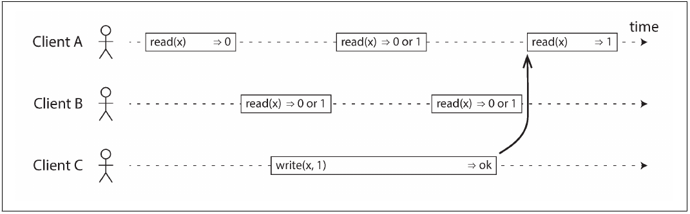
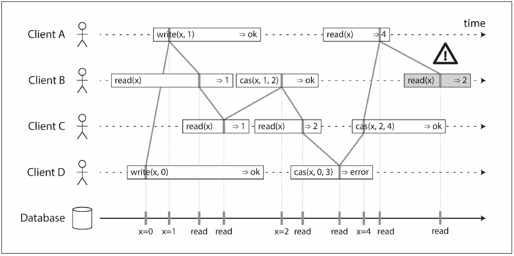

# Designing Data Intensive Applications
## Chapter 9: Consistency and Consensus
In this chapter, we will talk about some examples of algorithms and protocols for building fault-tolerant distributed
systems. We will assume that all the problems from Chapter 8 can occur: packets can be lost, reordered, duplicated, or
arbitrarily delayed in the network; clocks are approximate at best; and nodes can pause or crash at any time.

The best way of building fault-tolerant systems is to find some general-purpose abstractions with useful guarantees,
implement them once, and then let applications rely on those guarantees (like transaction in previous chapters). 

We will now continue along the same lines, and seek abstractions that can allow an application to ignore some of the
problems with distributed systems. For example, one of the most important abstractions for distributed systems is
consensus: that is, getting all of the nodes to agree on something. As we shall see in this chapter, reliably reaching
consensus in spite of network faults and process failures is a surprisingly tricky problem.

We need to understand the scope of what can and cannot be done: in some situations, it’s possible for the system to
tolerate faults and continue working; in other situations, that is not possible. The limits of what is and isn’t
possible have been explored in depth, both in theoretical proofs and in practical implementations. We will get an
overview of those fundamental limits in this chapter.

### Consistency Guarantees
In this chapter we will explore stronger consistency than eventual consistency models that data systems may choose to
provide. They don’t come for free: systems with stronger guarantees may have worse performance or be less fault-tolerant
than systems with weaker guarantees. Nevertheless, stronger guarantees can be appealing because they are easier to use
correctly. Once you have seen a few different consistency models, you’ll be in a better position to decide which one
best fits your needs.

Distributed consistency is mostly about coordinating the state of replicas in the face of delays and faults. This
chapter covers a broad range of topics, but as we shall see, these areas are in fact deeply linked:

* We will start by looking at one of the strongest consistency models in common use, linearizability, and examine its
  pros and cons.
* We’ll then examine the issue of ordering events in a distributed system, particularly around causality and total
  ordering.
* In the third section we will explore how to atomically commit a distributed transaction, which will finally lead us
  toward solutions for the consensus problem.

### Linearizability
In an eventually consistent database, if you ask two different replicas the same question at the same time, you may get
two different answers. That’s confusing. Wouldn’t it be a lot simpler if the database could give the illusion that there
is only one replica (i.e., only one copy of the data)? Then every client would have the same view of the data, and you
wouldn’t have to worry about replication lag.

This is the idea behind linearizability (also known as atomic consistency, strong consistency, immediate consistency, or
external consistency). The exact definition of linearizability is quite subtle, and we will explore it in the rest of
this section. But the basic idea is to make a system appear as if there were only one copy of the data, and all
operations on it are atomic. With this guarantee, even though there may be multiple replicas in reality, the application
does not need to worry about them.

In a linearizable system, as soon as one client successfully completes a write, all clients reading from the database
must be able to see the value just written. Maintaining the illusion of a single copy of the data means guaranteeing
that the value read is the most recent, up-to-date value, and doesn’t come from a stale cache or replica. In other
words, linearizability is a recency guarantee.

#### What Makes a System Linearizable?
The basic idea behind linearizability is simple: to make a system appear as if there is only a single copy of the data.
However, nailing down precisely what that means actually requires some care. In order to understand linearizability
better, let’s look at some more examples.

Figure below shows three clients concurrently reading and writing the same key x in a linearizable database. In the
distributed systems literature, `x` is called a `register`—in practice, it could be one key in a key-value store, one
row in a relational database, or one document in a document database, for example.

For simplicity, this figure shows only the requests from the clients’ point of view, not the internals of the database.
Each bar is a request made by a client, where the start of a bar is the time when the request was sent, and the end of a
bar is when the response was received by the client. Due to variable network delays, a client doesn’t know exactly when
the database processed its request—it only knows that it must have happened sometime between the client sending the
request and receiving the response.

In this example, the register has two types of operations:
* `read(x) ⇒ v` means the client requested to read the value of register x, and the database returned the value v.
* `write(x, v) ⇒ r` means the client requested to set the register x to value v, and the database returned response r
  (which could be ok or error).

In this figure, the value of x is initially 0, and client C performs a write request to set it to 1. While this is
happening, clients A and B are repeatedly polling the database to read the latest value. What are the possible responses
that A and B might get for their read requests?

* The first read operation by client A completes before the write begins, so it must definitely return the old value 0.
* The last read by client A begins after the write has completed, so it must definitely return the new value 1 if the
  database is linearizable: we know that the write must have been processed sometime between the start and end of the
  write operation, and the read must have been processed sometime between the start and end of the read operation. If
  the read started after the write ended, then the read must have been processed after the write, and therefore it must
  see the new value that was written.
* Any read operations that overlap in time with the write operation might return either 0 or 1, because we don’t know
  whether or not the write has taken effect at the time when the read operation is processed. These operations are
  concurrent with the write.

However, that is not yet sufficient to fully describe linearizability: if reads that are concurrent with a write can
return either the old or the new value, then readers could see a value flip back and forth between the old and the new
value several times while a write is going on. That is not what we expect of a system that emulates a “single copy of
the data.”

We can refine this timing diagram to visualize each operation taking effect atomically at some point in time. A more
complex example is shown in figure below.

In this figure we add a third type of operation besides read and write:

* `cas(x, vold, vnew) ⇒ r` means the client requested an atomic compare-and-set operation. If the current value of the
  register x equals vold, it should be atomically set to vnew. If x ≠ vold then the operation should leave the register
  unchanged and return an error. r is the database’s response (ok or error).

Each operation in this figure is marked with a vertical line (inside the bar for each operation) at the time when we
think the operation was executed. Those markers are joined up in a sequential order, and the result must be a valid
sequence of reads and writes for a register (every read must return the value set by the most recent write). The
requirement of linearizability is that the lines joining up the operation markers always move forward in time (from left
to right), never backward. This requirement

There are a few interesting details to point out in this figure:
* First client B sent a request to read x, then client D sent a request to set x to 0, and then client A sent a request
  to set x to 1. Nevertheless, the value returned to B’s read is 1 (the value written by A). This is okay: it means that
  the database first processed D’s write, then A’s write, and finally B’s read. Although this is not the order in which
  the requests were sent, it’s an acceptable order, because the three requests are concurrent. Perhaps B’s read request
  was slightly delayed in the network, so it only reached the database after the two writes.
* Client B’s read returned 1 before client A received its response from the database, saying that the write of the value
  1 was successful. This is also okay: it doesn’t mean the value was read before it was written, it just means the ok
  response from the database to client A was slightly delayed in the network.
* This model doesn’t assume any transaction isolation: another client may change a value at any time. For example, C
  first reads 1 and then reads 2, because the value was changed by B between the two reads. An atomic compare-and-set
  (cas) operation can be used to check the value hasn’t been concurrently changed by another client: B and C’s cas
  requests succeed, but D’s cas request fails (by the time the database processes it, the value of x is no longer 0).
* The final read by client B (in a shaded bar) is not linearizable. The operation is concurrent with C’s cas write,
  which updates x from 2 to 4. In the absence of other requests, it would be okay for B’s read to return 2. However,
  client A has already read the new value 4 before B’s read started, so B is not allowed to read an older value than A.

That is the intuition behind linearizability; the formal definition describes it more precisely. It is possible (though
computationally expensive) to test whether a system’s behavior is linearizable by recording the timings of all requests
and responses, and checking whether they can be arranged into a valid sequential order.

#### Relying on Linearizability
In what circumstances is linearizability useful? There a few areas in which linearizability is an important requirement
for making a system work correctly.

##### Locking and leader election
A system that uses single-leader replication needs to ensure that there is indeed only one leader, not several (split
brain). One way of electing a leader is to use a lock: every node that starts up tries to acquire the lock, and the one
that succeeds becomes the leader. No matter how this lock is implemented, it must be linearizable: all nodes must agree
which node owns the lock; otherwise it is useless.

##### Constraints and uniqueness guarantees
Uniqueness constraints are common in databases: for example, a username or email address must uniquely identify one
user. If you want to enforce this constraint as the data is written (such that if two people try to concurrently create
a user or a file with the same name, one of them will be returned an error), you need linearizability.

This situation is actually similar to a lock: when a user registers for your service, you can think of them acquiring a
“lock” on their chosen username. The operation is also very similar to an atomic compare-and-set, setting the username
to the ID of the user who claimed it, provided that the username is not already taken.

Similar issues arise if you want to ensure that a bank account balance never goes negative, or that you don’t sell more
items than you have in stock in the warehouse, or that two people don’t concurrently book the same seat on a flight or
in a theater. These constraints all require there to be a single up-to-date value (the account balance, the stock level,
the seat occupancy) that all nodes agree on.

##### Cross-channel timing dependencies
If another process does not read a value sooner, the main process would not know that the result of the query is stale.
The linearizability violation is only noticed because there was an additional communication channel in the system.

Without the recency guarantee of linearizability, race conditions between these two channels are possible.
Linearizability is not the only way of avoiding these race condition, but it’s the simplest to understand. If you
control the additional communication channel, you can use alternative approaches similar to what we discussed in
“Reading Your Own Writes” at the cost of additional complexity.

#### Implementing Linearizable Systems
Since linearizability essentially means “behave as though there is only a single copy of the data, and all operations on
it are atomic,” the simplest answer would be to really only use a single copy of the data. However, that approach would
not be able to tolerate faults: if the node holding that one copy failed, the data would be lost, or at least
inaccessible until the node was brought up again.

The most common approach to making a system fault-tolerant is to use replication. Let’s revisit the replication methods
from Chapter 5, and compare whether they can be made linearizable:

*Single-leader replication (potentially linearizable)*

In a system with single-leader replication, the leader has the primary copy of the data that is used for writes, and the
followers maintain backup copies of the data on other nodes. If you make reads from the leader, or from synchronously
updated followers, they have the potential to be linearizable. However, not every single-leader database is actually
linearizable, either by design (e.g., because it uses snapshot isolation) or due to concurrency bugs.

Using the leader for reads relies on the assumption that you know for sure who the leader is. As discussed before, it is
quite possible for a node to think that it is the leader, when in fact it is not—and if the delusional leader continues
to serve requests, it is likely to violate linearizability. With asynchronous replication, failover may even lose
committed writes, which violates both durability and linearizability.

*Consensus algorithms (linearizable)*

Some consensus algorithms, which we will discuss later in this chapter, bear a resemblance to single-leader replication.
However, consensus protocols contain measures to prevent split brain and stale replicas. Thanks to these details,
consensus algorithms can implement linearizable storage safely.

*Multi-leader replication (not linearizable)*

Systems with multi-leader replication are generally not linearizable, because they concurrently process writes on
multiple nodes and asynchronously replicate them to other nodes. For this reason, they can produce conflicting writes
that require resolution. Such conflicts are an artifact of the lack of a single copy of the data.

*Leaderless replication (probably not linearizable)*
For systems with leaderless replication, people sometimes claim that you can obtain “strong consistency” by requiring
quorum reads and writes (w + r > n). Depending on the exact configuration of the quorums, and depending on how you
define strong consistency, this is not quite true.

“Last write wins” conflict resolution methods based on time-of-day clocks  are almost certainly nonlinearizable, because
clock timestamps cannot be guaranteed to be consistent with actual event ordering due to clock skew. Sloppy quorums also
ruin any chance of linearizability. Even with strict quorums, nonlinearizable behavior is possible.

#### The Cost of Linearizability
##### The CAP theorem
* If your application requires linearizability, and some replicas are disconnected from the other replicas due to a
  network problem, then some replicas cannot process requests while they are disconnected: they must either wait until
  the network problem is fixed, or return an error (either way, they become unavailable).
* If your application does not require linearizability, then it can be written in a way that each replica can process
  requests independently, even if it is disconnected from other replicas (e.g., multi-leader). In this case, the
  application can remain available in the face of a network problem, but its behavior is not linearizable.

Thus, applications that don’t require linearizability can be more tolerant of network problems. This insight is
popularly known as the CAP theorem, named by Eric Brewer in 2000, although the trade-off has been known to designers of
distributed databases since the 1970s.

CAP was originally proposed as a rule of thumb, without precise definitions, with the goal of starting a discussion
about trade-offs in databases. At the time, many distributed databases focused on providing linearizable semantics on a
cluster of machines with shared storage, and CAP encouraged database engineers to explore a wider design space of
distributed shared-nothing systems, which were more suitable for implementing large-scale web services. CAP deserves
credit for this culture shift—witness the explosion of new database technologies since the mid-2000s (known as NoSQL).

CAP is sometimes presented as Consistency, Availability, Partition tolerance: pick 2 out of 3. Unfortunately, putting it
this way is misleading because network partitions are a kind of fault, so they aren’t something about which you have a
choice: they will happen whether you like it or not.

At times when the network is working correctly, a system can provide both consistency (linearizability) and total
availability. When a network fault occurs, you have to choose between either linearizability or total availability.
Thus, a better way of phrasing CAP would be either Consistent or Available when Partitioned. A more reliable network
needs to make this choice less often, but at some point the choice is inevitable.

In discussions of CAP there are several contradictory definitions of the term availability, and the formalization as a
theorem does not match its usual meaning. Many so-called “highly available” (fault-tolerant) systems actually do not
meet CAP’s idiosyncratic definition of availability. All in all, there is a lot of misunderstanding and confusion around
CAP, and it does not help us understand systems better, so CAP is best avoided.

The CAP theorem as formally defined is of very narrow scope: it only considers one consistency model (namely
linearizability) and one kind of fault (network partitions, or nodes that are alive but disconnected from each other).
It doesn’t say anything about network delays, dead nodes, or other trade-offs. Thus, although CAP has been historically
influential, it has little practical value for designing systems.

There are many more interesting impossibility results in distributed systems, and CAP has now been superseded by more
precise results, so it is of mostly historical interest today.

##### Linearizability and network delays
Although linearizability is a useful guarantee, surprisingly few systems are actually linearizable in practice. For
example, even RAM on a modern multi-core CPU is not linearizable: if a thread running on one CPU core writes to a memory
address, and a thread on another CPU core reads the same address shortly afterward, it is not guaranteed to read the
value written by the first thread.

The reason for this behavior is that every CPU core has its own memory cache and store buffer. Memory access first goes
to the cache by default, and any changes are asynchronously written out to main memory. Since accessing data in the
cache is much faster than going to main memory, this feature is essential for good performance on modern CPUs. However,
there are now several copies of the data (one in main memory, and perhaps several more in various caches), and these
copies are asynchronously updated, so linearizability is lost.

Why make this trade-off? It makes no sense to use the CAP theorem to justify the multi-core memory consistency model:
within one computer we usually assume reliable communication, and we don’t expect one CPU core to be able to continue
operating normally if it is disconnected from the rest of the computer. The reason for dropping linearizability is
performance, not fault tolerance.

The same is true of many distributed databases that choose not to provide linearizable guarantees: they do so primarily
to increase performance, not so much for fault tolerance. Linearizability is slow—and this is true all the time, not
only during a network fault.

Can’t we maybe find a more efficient implementation of linearizable storage? It seems the answer is no: Attiya and Welch
prove that if you want linearizability, the response time of read and write requests is at least proportional to the
uncertainty of delays in the network. In a network with highly variable delays, like most computer networks, the
response time of linearizable reads and writes is inevitably going to be high. A faster algorithm for linearizability
does not exist, but weaker consistency models can be much faster, so this trade-off is important for latency-sensitive
systems. In Chapter 12 we will discuss some approaches for avoiding linearizability without sacrificing correctness.

### Ordering Guarantees
Ordering has been a recurring theme in this book, which suggests that it might be an important fundamental idea. Let’s
briefly recap some of the other contexts in which we have discussed ordering:

* In Chapter 5 we saw that the main purpose of the leader in single-leader replication is to determine the order of
  writes in the replication log—that is, the order in which followers apply those writes. If there is no single leader,
  conflicts can occur due to concurrent operations.
* Serializability, which we discussed in Chapter 7, is about ensuring that transactions behave as if they were executed
  in some sequential order. It can be achieved by literally executing transactions in that serial order, or by allowing
  concurrent execution while preventing serialization conflicts (by locking or aborting).
* The use of timestamps and clocks in distributed systems that we discussed in Chapter 8 is another attempt to introduce
  order into a disorderly world, for example to determine which one of two writes happened later.

It turns out that there are deep connections between ordering, linearizability, and consensus. Although this notion is a
bit more theoretical and abstract than the rest of this book, it is very helpful for clarifying our understanding of
what systems can and cannot do. We will explore this topic in the next few sections.

#### Ordering and Causality
There are several reasons why ordering keeps coming up, and one of the reasons is that it helps preserve causality.
Causality imposes an ordering on events: cause comes before effect; a message is sent before that message is received;
the question comes before the answer. And, like in real life, one thing leads to another: one node reads some data and
then writes something as a result, another node reads the thing that was written and writes something else in turn, and
so on. These chains of causally dependent operations define the causal order in the system—i.e., what happened before
what.

If a system obeys the ordering imposed by causality, we say that it is `causally consistent`. For example, snapshot
isolation provides causal consistency: when you read from the database, and you see some piece of data, then you must
also be able to see any data that causally precedes it (assuming it has not been deleted in the meantime).

##### The causal order is not a total order
A total order allows any two elements to be compared, so if you have two elements, you can always say which one is
greater and which one is smaller. For example, natural numbers are totally ordered. However, mathematical sets are not
totally ordered: is {a, b} greater than {b, c}? Well, you can’t really compare them, because neither is a subset of the
other. We say they are incomparable, and therefore mathematical sets are partially ordered: in some cases one set is
greater than another, but in other cases they are incomparable.

The difference between a total order and a partial order is reflected in different database consistency models:

*Linearizability*

In a linearizable system, we have a total order of operations: if the system behaves as if there is only a single copy
of the data, and every operation is atomic, this means that for any two operations we can always say which one happened
first.

*Causality*

We said that two operations are concurrent if neither happened before the other. Put another way, two events are ordered
if they are causally related (one happened before the other), but they are incomparable if they are concurrent. This
means that causality defines a partial order, not a total order: some operations are ordered with respect to each other,
but some are incomparable.

Therefore, according to this definition, there are no concurrent operations in a linearizable datastore: there must be
a single timeline along which all operations are totally ordered. There might be several requests waiting to be handled,
but the datastore ensures that every request is handled atomically at a single point in time, acting on a single copy
of the data, along a single timeline, without any concurrency.

Concurrency would mean that the timeline branches and merges again—and in this case, operations on different branches
are incomparable (pretty much like the distributed version control systems such as git where often one commit happens
after another, in a straight line, but sometimes you get branches)

##### Linearizability is stronger than causal consistency
Linearizability implies causality: any system that is linearizable will preserve causality correctly. As discussed
before, Linearizability can harm performance and availability.  For this reason, some distributed data systems have
abandoned linearizability, which allows them to achieve better performance but can
make them difficult to work with.

The good news is that a middle ground is possible. Linearizability is not the only way of preserving causality—there are
other ways too. A system can be causally consistent without incurring the performance hit of making it linearizable (in
particular, the CAP theorem does not apply). In fact, causal consistency is the strongest possible consistency model
that does not slow down due to network delays, and remains available in the face of network failures.

In many cases, systems that appear to require linearizability in fact only really require causal consistency, which can
be implemented more efficiently. Based on this observation, researchers are exploring new kinds of databases that
preserve causality, with performance and availability characteristics that are similar to those of eventually consistent
systems.

As this research is quite recent, not much of it has yet made its way into production systems, and there are still
challenges to be overcome. However, it is a promising direction for future systems.

#### Sequence Number Ordering
We can use sequence numbers or timestamps to order events. Such sequence numbers or timestamps are compact, and they
provide a total order: that is, every operation has a unique sequence number, and you can always compare two sequence
numbers to determine which is greater.

In a database with single-leader replication, the replication log defines a total order of write operations that is
consistent with causality. The leader can simply increment a counter for each operation, and thus assign a monotonically
increasing sequence number to each operation in the replication log. If a follower applies the writes in the order they
appear in the replication log, the state of the follower is always causally consistent (even if it is lagging behind the
leader).

##### Noncausal sequence number generators
If there is not a single leader, it is less clear how to generate sequence numbers for operations. Various methods are
used in practice:

* Each node can generate its own independent set of sequence numbers. For example, if you have two nodes, one node can
  generate only odd numbers and the other only even numbers.
* You can attach a timestamp from a time-of-day clock (physical clock) to each operation. Such timestamps are not
  sequential, but if they have sufficiently high resolution, they might be sufficient to totally order operations.
* You can preallocate blocks of sequence numbers. For example, node A might claim the block of sequence numbers from 1
  to 1,000, and node B might claim the block from 1,001 to 2,000. Then each node can independently assign sequence
  numbers from its block, and allocate a new block when its supply of sequence numbers begins to run low.

These three options all have a problem: the sequence numbers they generate are not consistent with causality. The
causality problems occur because these sequence number generators do not correctly capture the ordering of operations
across different nodes.

##### Lamport timestamps
Although the three sequence number generators just described are inconsistent with
causality, there is actually a simple method for generating sequence numbers that is
consistent with causality. It is called a *Lamport timestamp*.

In Lamport timestamps Each node has a unique identifier, and each node keeps a counter of the number of operations it
has processed. The Lamport timestamp is then simply a pair of (counter, node ID). Two nodes may sometimes have the same
counter value, but by including the node ID in the timestamp, each timestamp is made unique.

This description is essentially the same as the even/odd counters described in the last section. The key idea about
Lamport timestamps, which makes them consistent with causality, is the following: every node and every client keeps
track of the maximum counter value it has seen so far, and includes that maximum on every request. When a node receives
a request or response with a maximum counter value greater than its own counter value, it immediately increases its own
counter to that maximum.

As long as the maximum counter value is carried along with every operation, this scheme ensures that the ordering from
the Lamport timestamps is consistent with causality, because every causal dependency results in an increased timestamp.
Lamport timestamps are sometimes confused with version vectors, which we saw earlier. Although there are some
similarities, they have a different purpose: version vectors can distinguish whether two operations are concurrent or
whether one is causally dependent on the other, whereas Lamport timestamps always enforce a total ordering. From the
total ordering of Lamport timestamps, you cannot tell whether two operations are concurrent or whether they are causally
dependent. The advantage of Lamport timestamps over version vectors is that they are more compact.

##### Timestamp ordering is not sufficient
Although Lamport timestamps define a total order of operations that is consistent with causality, they are not quite
sufficient to solve many common problems in distributed systems.

At first glance, it seems as though a total ordering of operations (e.g., using Lamport timestamps) should be sufficient
to solve this problem: if two accounts with the same username are created, pick the one with the lower timestamp as the
winner (the one who grabbed the username first), and let the one with the greater timestamp fail. Since timestamps are
totally ordered, this comparison is always valid.

In order to implement something like a uniqueness constraint for usernames, it’s not sufficient to have a total ordering
of operations—you also need to know when that order is finalized. If you have an operation to create a username, and you
are sure that no other node can insert a claim for the same username ahead of your operation in the total order, then
you can safely declare the operation successful.

This idea of knowing when your total order is finalized is captured in the topic of *total order broadcast*.

#### Total Order Broadcast
As discussed, single-leader replication determines a total order of operations by choosing one node as the leader and
sequencing all operations on a single CPU core on the leader. The challenge then is how to scale the system if the
throughput is greater than a single leader can handle, and also how to handle failover if the leader fails. In the
distributed systems literature, this problem is known as total order broadcast or atomic broadcast.

Total order broadcast is usually described as a protocol for exchanging messages between nodes. Informally, it requires
that two safety properties always be satisfied:

*Reliable delivery*

No messages are lost: if a message is delivered to one node, it is delivered to all nodes.

*Totally ordered delivery*

Messages are delivered to every node in the same order.

A correct algorithm for total order broadcast must ensure that the reliability and ordering properties are always
satisfied, even if a node or the network is faulty. Of course, messages will not be delivered while the network is
interrupted, but an algorithm can keep retrying so that the messages get through when the network is eventually repaired
(and then they must still be delivered in the correct order).

##### Using total order broadcast
An important aspect of total order broadcast is that the order is fixed at the time the messages are delivered: a node
is not allowed to retroactively insert a message into an earlier position in the order if subsequent messages have
already been delivered. This fact makes total order broadcast stronger than timestamp ordering.

Another way of looking at total order broadcast is that it is a way of creating a log (as in a replication log,
transaction log, or write-ahead log): delivering a message is like appending to the log. Since all nodes must deliver
the same messages in the same order, all nodes can read the log and see the same sequence of messages.

If you have total order broadcast, you can build linearizable storage on top of it. We can also turn it around, assume
that we have linearizable storage, and build total order broadcast from it.

### Distributed Transactions and Consensus
Now that we have discussed replication (Chapter 5), transactions (Chapter 7), system models (Chapter 8),
linearizability, and total order broadcast (this chapter), we are finally ready to tackle the consensus problem.
Consensus is one of the most important and fundamental problems in distributed computing. On the surface, it seems
simple: informally, the goal is simply to get several nodes to agree on something. There are a number of situations such
as leader election and atomic commit which it is important for nodes to agree.

In this section we will first examine the atomic commit problem in more detail. In particular, we will discuss the
two-phase commit (2PC) algorithm, which is the most common way of solving atomic commit and which is implemented in
various databases, messaging systems, and application servers. It turns out that 2PC is a kind of consensus
algorithm—but not a very good one.

By learning from 2PC we will then work our way toward better consensus algorithms, such as those used in ZooKeeper (Zab)
and etcd (Raft).

#### Atomic Commit and Two-Phase Commit (2PC)
Atomicity prevents failed transactions from littering the database with half-finished results and half-updated state.
This is especially important for multi-object transactions and databases that maintain secondary indexes. Each secondary
index is a separate data structure from the primary data—thus, if you modify some data, the corresponding change needs
to also be made in the secondary index. Atomicity ensures that the secondary index stays consistent with the primary
data (if the index became inconsistent with the primary data, it would not be very useful).

##### From single-node to distributed atomic commit
In these cases, it is not sufficient to simply send a commit request to all of the nodes and independently commit the
transaction on each one. In doing so, it could easily happen that the commit succeeds on some nodes and fails on other
nodes, which would violate the atomicity guarantee:

* Some nodes may detect a constraint violation or conflict, making an abort necessary, while other nodes are
  successfully able to commit.
* Some of the commit requests might be lost in the network, eventually aborting due to a timeout, while other commit
  requests get through.
* Some nodes may crash before the commit record is fully written and roll back on recovery, while others successfully
  commit.

For these reason, a node must only commit once it is certain that all other nodes in the transaction are also going to
commit.

A transaction commit must be irrevocable—you are not allowed to change your mind and retroactively abort a transaction
after it has been committed. The reason for this rule is that once data has been committed, it becomes visible to other
transactions, and thus other clients may start relying on that data; this principle forms the basis of read committed
isolation. If a transaction was allowed to abort after committing, any transactions that read the committed data would
be based on data that was retroactively declared not to have existed—so they would have to be reverted as well.

##### Introduction to two-phase commit
Two-phase commit is an algorithm for achieving atomic transaction commit across multiple nodes—i.e., to ensure that
either all nodes commit or all nodes abort. It is a classic algorithm in distributed databases. 2PC is used internally
in some databases and also made available to applications in the form of XA transactions.

The basic flow of 2PC is illustrated in the figure below. Instead of a single commit request, as with a single-node
transaction, the commit/abort process in 2PC is split into two phases (hence the name).

2PC uses a new component that does not normally appear in single-node transactions: a coordinator (also known as
transaction manager). The coordinator is often implemented as a library within the same application process that is
requesting the transaction (e.g., embedded in a Java EE container), but it can also be a separate process or service.

A 2PC transaction begins with the application reading and writing data on multiple database nodes, as normal. We call
these database nodes participants in the transaction. When the application is ready to commit, the coordinator begins
phase 1: it sends a prepare request to each of the nodes, asking them whether they are able to commit. The coordinator
then tracks the responses from the participants:

* If all participants reply “yes,” indicating they are ready to commit, then the coordinator sends out a commit request
  in phase 2, and the commit actually takes place.
* If any of the participants replies “no,” the coordinator sends an abort request to all nodes in phase 2.

This process is somewhat like the traditional marriage ceremony in Western cultures: the minister asks the bride and
groom individually whether each wants to marry the other, and typically receives the answer “I do” from both. After
receiving both acknowledgments, the minister pronounces the couple husband and wife: the transaction is committed, and
the happy fact is broadcast to all attendees. If either bride or groom does not say “yes,” the ceremony is aborted.

##### A system of promises
From this short description it might not be clear why two-phase commit ensures atomicity, while one-phase commit across
several nodes does not. Surely the prepare and commit requests can just as easily be lost in the two-phase case. What
makes 2PC different?

To understand why it works, we have to break down the process in a bit more detail:

1. When the application wants to begin a distributed transaction, it requests a transaction ID from the coordinator.
   This transaction ID is globally unique.
2. The application begins a single-node transaction on each of the participants, and attaches the globally unique
   transaction ID to the single-node transaction. All reads and writes are done in one of these single-node
   transactions. If anything goes wrong at this stage (for example, a node crashes or a request times out), the
   coordinator or any of the participants can abort.
3. When the application is ready to commit, the coordinator sends a prepare request to all participants, tagged with the
   global transaction ID. If any of these requests fails or times out, the coordinator sends an abort request for that
   transaction ID to all participants.
4. When a participant receives the prepare request, it makes sure that it can definitely commit the transaction under
   all circumstances. This includes writing all transaction data to disk (a crash, a power failure, or running out of
   disk space is not an acceptable excuse for refusing to commit later), and checking for any conflicts or constraint
   violations. By replying “yes” to the coordinator, the node promises to commit the transaction without error if
   requested. In other words, the participant surrenders the right to abort the transaction, but without actually
   committing it.
5. When the coordinator has received responses to all prepare requests, it makes a definitive decision on whether to
   commit or abort the transaction (committing only if all participants voted “yes”). The coordinator must write that
   decision to its transaction log on disk so that it knows which way it decided in case it subsequently crashes. This
   is called the commit point.
6. Once the coordinator’s decision has been written to disk, the commit or abort request is sent to all participants. If
   this request fails or times out, the coordinator must retry forever until it succeeds. There is no more going back:
   if the decision was to commit, that decision must be enforced, no matter how many retries it takes. If a participant
   has crashed in the meantime, the transaction will be committed when it recovers—since the participant voted “yes,” it
   cannot refuse to commit when it recovers.

Thus, the protocol contains two crucial “points of no return”: when a participant votes “yes,” it promises that it will
definitely be able to commit later (although the coordinator may still choose to abort); and once the coordinator
decides, that decision is irrevocable. Those promises ensure the atomicity of 2PC. (Single-node atomic commit lumps
these two events into one: writing the commit record to the transaction log.)

##### Coordinator failure
If the coordinator fails before sending the prepare requests, a participant can safely abort the transaction. But once
the participant has received a prepare request and voted “yes,” it can no longer abort unilaterally—it must wait to hear
back from the coordinator whether the transaction was committed or aborted. If the coordinator crashes or the network
fails at this point, the participant can do nothing but wait. A participant’s transaction in this state is called in
doubt or uncertain.

In principle, the participants could communicate among themselves to find out how each participant voted and come to
some agreement, but that is not part of the 2PC protocol.

The only way 2PC can complete is by waiting for the coordinator to recover. This is why the coordinator must write its
commit or abort decision to a transaction log on disk before sending commit or abort requests to participants: when the
coordinator recovers, it determines the status of all in-doubt transactions by reading its transaction log. Any
transactions that don’t have a commit record in the coordinator’s log are aborted. Thus, the commit point of 2PC comes
down to a regular single-node atomic commit on the coordinator.

#### Distributed Transactions in Practice
Distributed transactions, especially those implemented with two-phase commit, have a mixed reputation. On the one hand,
they are seen as providing an important safety guarantee that would be hard to achieve otherwise; on the other hand,
they are criticized for causing operational problems, killing performance, and promising more than they can deliver.
Many cloud services choose not to implement distributed transactions due to the operational problems they engender.

However, rather than dismissing distributed transactions outright, we should examine them in some more detail, because
there are important lessons to be learned from them. To begin, we should be precise about what we mean by “distributed
transactions.” Two quite different types of distributed transactions are often conflated:

*Database-internal distributed transactions*

Some distributed databases (i.e., databases that use replication and partitioning in their standard configuration)
support internal transactions among the nodes of that database. In this case, all the nodes participating in the
transaction are running the same database software.

*Heterogeneous distributed transactions*

In a heterogeneous transaction, the participants are two or more different technologies: for example, two databases from
different vendors, or even non-database systems such as message brokers. A distributed transaction across these systems
must ensure atomic commit, even though the systems may be entirely different under the hood.

Database-internal transactions do not have to be compatible with any other system, so they can use any protocol and
apply optimizations specific to that particular technology. For that reason, database-internal distributed transactions
can often work quite well. On the other hand, transactions spanning heterogeneous technologies are a lot more
challenging.

##### Exactly-once message processing
Heterogeneous distributed transactions allow diverse systems to be integrated in powerful ways. For example, a message
from a message queue can be acknowledged as processed if and only if the database transaction for processing the message
was successfully committed. This is implemented by atomically committing the message acknowledgment and the database
writes in a single transaction. With distributed transaction support, this is possible, even if the message broker and
the database are two unrelated technologies running on different machines.

If either the message delivery or the database transaction fails, both are aborted, and so the message broker may safely
redeliver the message later. Thus, by atomically committing the message and the side effects of its processing, we can
ensure that the message is effectively processed exactly once, even if it required a few retries before it succeeded.
The abort discards any side effects of the partially completed transaction.

Such a distributed transaction is only possible if all systems affected by the transaction are able to use the same
atomic commit protocol, however. For example, say a side effect of processing a message is to send an email, and the
email server does not support two-phase commit: it could happen that the email is sent two or more times if message
processing fails and is retried. But if all side effects of processing a message are rolled back on transaction abort,
then the processing step can safely be retried as if nothing had happened.

We will return to the topic of exactly-once message processing in Chapter 11. Let’s
look first at the atomic commit protocol that allows such heterogeneous distributed
transactions.

##### XA transactions
X/Open XA (short for eXtended Architecture) is a standard for implementing two-phase commit across heterogeneous
technologies. It was introduced in 1991 and has been widely implemented: XA is supported by many traditional relational
databases and message brokers.

The transaction coordinator implements the XA API. The standard does not specify how it should be implemented, but in
practice the coordinator is often simply a library that is loaded into the same process as the application issuing the
transaction (not a separate service). It keeps track of the participants in a transaction, collects partipants’
responses after asking them to prepare (via a callback into the driver), and uses a log on the local disk to keep track
of the commit/abort decision for each transaction.

If the application process crashes, or the machine on which the application is running dies, the coordinator goes with
it. Any participants with prepared but uncommitted transactions are then stuck in doubt. Since the coordinator’s log is
on the application server’s local disk, that server must be restarted, and the coordinator library must read the log to
recover the commit/abort outcome of each transaction. Only then can the coordinator use the database driver’s XA
callbacks to ask participants to commit or abort, as appropriate. The database server cannot contact the coordinator
directly, since all communication must go via its client library.

##### Holding locks while in doubt
When using two-phase commit, a transaction must hold onto the locks throughout the time it is in doubt. If the
coordinator has crashed and takes 20 minutes to start up again, those locks will be held for 20 minutes. If the
coordinator’s log is entirely lost for some reason, those locks will be held forever—or at least until the situation is
manually resolved by an administrator. What this means is that eventually, this can cause large parts of your
application to become unavailable until the in-doubt transaction is resolved.

##### Recovering from coordinator failure
In theory, if the coordinator crashes and is restarted, it should cleanly recover its state from the log and resolve any
in-doubt transactions. However, in practice, orphaned in-doubt transactions do occur—that is, transactions for which the
coordinator cannot decide the outcome for whatever reason (e.g., because the transaction log has been lost or corrupted
due to a software bug). These transactions cannot be resolved automatically, so they sit forever in the database,
holding locks and blocking other transactions.

Even rebooting your database servers will not fix this problem, since a correct implementation of 2PC must preserve the
locks of an in-doubt transaction even across restarts (otherwise it would risk violating the atomicity guarantee). It’s
a sticky situation.

The only way out is for an administrator to manually decide whether to commit or roll back the transactions. The
administrator must examine the participants of each in-doubt transaction, determine whether any participant has
committed or aborted already, and then apply the same outcome to the other participants. Resolving the problem
potentially requires a lot of manual effort, and most likely needs to be done under high stress and time pressure during
a serious production outage (otherwise, why would the coordinator be in such a bad state?).

Many XA implementations have an emergency escape hatch called heuristic decisions: allowing a participant to
unilaterally decide to abort or commit an in-doubt transaction without a definitive decision from the coordinator. To be
clear, heuristic here is a euphemism for probably breaking atomicity, since it violates the system of promises in
two-phase commit. Thus, heuristic decisions are intended only for getting out of catastrophic situations, and not for
regular use.

##### Limitations of distributed transactions
XA transactions solve the real and important problem of keeping several participant data systems consistent with each
other, but as we have seen, they also introduce major operational problems. In particular, the key realization is that
the transaction coordinator is itself a kind of database (in which transaction outcomes are stored), and so it needs to
be approached with the same care as any other important database:

* If the coordinator is not replicated but runs only on a single machine, it is a single point of failure for the entire
  system (since its failure causes other application servers to block on locks held by in-doubt transactions).
* Many server-side applications are developed in a stateless model (as favored by HTTP), with all persistent state
  stored in a database, which has the advantage Distributed Transactions and Consensus that application servers can be
  added and removed at will. However, when the coordinator is part of the application server, it changes the nature of
  the deployment. Suddenly, the coordinator’s logs become a crucial part of the durable system state—as important as the
  databases themselves, since the coordinator logs are required in order to recover in-doubt transactions after a crash.
  Such application servers are no longer stateless.
* Since XA needs to be compatible with a wide range of data systems, it is necessarily a lowest common denominator. For
  example, it cannot detect deadlocks across different systems, and it does not work with Serializable Snapshot
  Isolation (SSI), since that would require a protocol for identifying conflicts across different systems.
* For database-internal distributed transactions (not XA), the limitations are not so great—for example, a distributed
  version of SSI is possible. However, there remains the problem that for 2PC to successfully commit a transaction, all
  participants must respond. Consequently, if any part of the system is broken, the transaction also fails. Distributed
  transactions thus have a tendency of amplifying failures, which runs counter to our goal of building fault-tolerant
  systems.

Do these facts mean we should give up all hope of keeping several systems consistent with each other? Not quite—there
are alternative methods that allow us to achieve the same thing without the pain of heterogeneous distributed
transactions. We will return to these in Chapters 11 and 12. But first, we should wrap up the topic of consensus.

#### Fault-Tolerant Consensus
Informally, consensus means getting several nodes to agree on something. The consensus problem is normally formalized as
follows: one or more nodes may propose values, and the consensus algorithm decides on one of those values.

In this formalism, a consensus algorithm must satisfy the following properties:

* Uniform agreement: No two nodes decide differently.
* Integrity: No node decides twice.
* Validity: If a node decides value v, then v was proposed by some node.
* Termination: Every node that does not crash eventually decides some value.

The uniform agreement and integrity properties define the core idea of consensus: everyone decides on the same outcome,
and once you have decided, you cannot change your mind. The validity property exists mostly to rule out trivial
solutions: for example, you could have an algorithm that always decides null, no matter what was proposed; this
algorithm would satisfy the agreement and integrity properties, but not the validity property.

The termination property formalizes the idea of fault tolerance. It essentially says that a consensus algorithm cannot
simply sit around and do nothing forever (like 2PC when coordinator fails)—in other words, it must make progress. Even
if some nodes fail, the other nodes must still reach a decision. 

The termination property is subject to the assumption that fewer than half of the nodes are crashed or unreachable.
However, most implementations of consensus ensure that the safety properties—agreement, integrity, and validity—are
always met, even if a majority of nodes fail or there is a severe network problem. Thus, a large-scale outage can stop
the system from being able to process requests, but it cannot corrupt the consensus system by causing it to make invalid
decisions.

##### Consensus algorithms and total order broadcast
Most of consensus algorithms actually don’t directly use the formal model described before. Instead, they decide on a
sequence of values, which makes them total order broadcast algorithms, as discussed previously in this chapter.

Remember that total order broadcast requires messages to be delivered exactly once, in the same order, to all nodes. If
you think about it, this is equivalent to performing several rounds of consensus: in each round, nodes propose the
message that they want to send next, and then decide on the next message to be delivered in the total order.

So, total order broadcast is equivalent to repeated rounds of consensus (each consensus decision corresponding to one
message delivery):

* Due to the agreement property of consensus, all nodes decide to deliver the same messages in the same order.
* Due to the integrity property, messages are not duplicated.
* Due to the validity property, messages are not corrupted and not fabricated out of thin air.
* Due to the termination property, messages are not lost.

##### Single-leader replication and consensus
In a single-leader replication, if the leader is manually chosen and configured by the humans in your operations team,
you essentially have a “consensus algorithm” of the dictatorial variety. Some databases perform automatic leader
election and failover, promoting a follower to be the new leader if the old leader fails. This brings us closer to
fault-tolerant total order broadcast, and thus to solving consensus.

However, there is a problem. We previously discussed the problem of split brain, and said that all nodes need to agree
who the leader is—otherwise two different nodes could each believe themselves to be the leader, and consequently get the
database into an inconsistent state. Thus, we need consensus in order to elect a leader. But if the consensus algorithms
described here are actually total order broadcast algorithms, and total order broadcast is like single-leader
replication, and single-leader replication requires a leader, then...

It seems that in order to elect a leader, we first need a leader. In order to solve consensus, we must first solve
consensus. How do we break out of this conundrum?

##### Epoch numbering and quorums
All of the consensus protocols discussed so far internally use a leader in some form or another, but they don’t
guarantee that the leader is unique. Instead, they can make a weaker guarantee: the protocols define an epoch number and
guarantee that within each epoch, the leader is unique.

Every time the current leader is thought to be dead, a vote is started among the nodes to elect a new leader. This
election is given an incremented epoch number, and thus epoch numbers are totally ordered and monotonically increasing.
If there is a conflict between two different leaders in two different epochs (perhaps because the previous leader
actually wasn’t dead after all), then the leader with the higher epoch number prevails.

Before a leader is allowed to decide anything, it must first check that there isn’t some other leader with a higher
epoch number which might take a conflicting decision. How does a leader know that it hasn’t been ousted by another node?
Recall “The Truth Is Defined by the Majority” on page 300: a node cannot necessarily trust its own judgment—just because
a node thinks that it is the leader, that does not necessarily mean the other nodes accept it as their leader.

Instead, it must collect votes from a quorum of nodes. For every decision that a leader wants to make, it must send the
proposed value to the other nodes and wait for a quorum of nodes to respond in favor of the proposal. The quorum
typically, but not always, consists of a majority of nodes. A node votes in favor of a proposal only if it is not aware
of any other leader with a higher epoch.

Thus, we have two rounds of voting: once to choose a leader, and a second time to vote on a leader’s proposal. The key
insight is that the quorums for those two votes must overlap: if a vote on a proposal succeeds, at least one of the
nodes that voted for it must have also participated in the most recent leader election [105]. Thus, if the vote on a
proposal does not reveal any higher-numbered epoch, the current leader can conclude that no leader election with a
higher epoch number has happened, and therefore be sure that it still holds the leadership. It can then safely decide
the proposed value.

##### Limitations of consensus
Consensus algorithms are not used everywhere, because the benefits come at a cost. The process by which nodes vote on
proposals before they are decided is a kind of synchronous replication. In this setting, databases are often configured
to use asynchronous replication. In this configuration, some committed data can potentially be lost on failover—but many
people choose to accept this risk for the sake of better performance.

Consensus systems always require a strict majority to operate. This means you need a minimum of three nodes in order to
tolerate one failure (the remaining two out of three form a majority), or a minimum of five nodes to tolerate two
failures (the remaining three out of five form a majority). If a network failure cuts off some nodes from the rest, only
the majority portion of the network can make progress, and the rest is blocked.

Most consensus algorithms assume a fixed set of nodes that participate in voting, which means that you can’t just add or
remove nodes in the cluster. Dynamic membership extensions to consensus algorithms allow the set of nodes in the cluster
to change over time, but they are much less well understood than static membership algorithms.

Consensus systems generally rely on timeouts to detect failed nodes. In environments with highly variable network
delays, especially geographically distributed systems, it often happens that a node falsely believes the leader to have
failed due to a transient network issue. Although this error does not harm the safety properties, frequent leader
elections result in terrible performance because the system can end up spending more time choosing a leader than doing
any useful work.

#### Membership and Coordination Services
As an application developer, you will rarely need to use ZooKeeper directly, because it is actually not well suited as a
general-purpose database. It is more likely that you will end up relying on it indirectly via some other project: for
example, HBase, Hadoop YARN, OpenStack Nova, and Kafka all rely on ZooKeeper running in the background. What is it that
these projects get from it?

ZooKeeper and etcd are designed to hold small amounts of data that can fit entirely in memory (although they still write
to disk for durability)—so you wouldn’t want to store all of your application’s data here. That small amount of data is
replicated across all the nodes using a fault-tolerant total order broadcast algorithm. As discussed previously, total
order broadcast is just what you need for database replication: if each message represents a write to the database,
applying the same writes in the same order keeps replicas consistent with each other.

ZooKeeper is modeled after Google’s Chubby lock service, implementing not only total order broadcast (and hence
consensus), but also an interesting set of other features that turn out to be particularly useful when building
distributed systems:

* Linearizable atomic operations
* Total ordering of operations
* Failure detection
* Change notifications

Of these features, only the linearizable atomic operations really require consensus.
However, it is the combination of these features that makes systems like ZooKeeper
so useful for distributed coordination.

